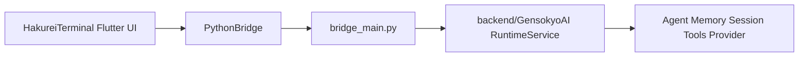

# HakureiTerminal

HakureiTerminal 是一个 Flutter 桌面客户端项目，内嵌并调用 GensokyoAI 后端源码快照。

本仓库现在以 HakureiTerminal 为主项目：

- Flutter UI 位于仓库根目录的 `lib/`、`windows/`、`linux/`、`test/`。
- GensokyoAI 后端源码作为内部组件放在 `backend/GensokyoAI/`。
- `bridge_main.py` 是 HakureiTerminal 维护的 Python bridge 入口，负责启动内嵌后端 Runtime。
- 构建时不会从外部下载 GensokyoAI，也不会通过 pip 安装 GensokyoAI；只复制本仓库中的内嵌源码。
- 仓库根项目 HakureiTerminal 采用 BSD 3-Clause License；内嵌 GensokyoAI 源码快照保留其 MIT License，详见 `THIRD_PARTY_LICENSES.md`。

## 架构边界

HakureiTerminal 是用户界面、配置管理和本地 Runtime 子进程管理层；GensokyoAI 是内嵌后端组件，负责角色推理、记忆、会话、工具调用、Provider 调用和可选依赖管理。



允许的方向：

- Flutter 通过 JSON Lines RPC 调用 Python Runtime。
- Flutter 传递标准 JSON 参数，例如角色路径、模型配置、Provider 名称。
- Python Runtime 返回标准 JSON 结果或结构化错误。

禁止的方向：

- Flutter 不实现 OpenAI、Claude、Gemini、Ollama 等 Provider 的真实模型调用。
- Flutter 不直接读写 Python 后端 session 或 memory 文件。
- Flutter 不向后端传任意 pip 包名或 shell 命令。
- Python 后端不依赖 Flutter UI、窗口状态或客户端存档结构。

## Runtime 调用

客户端通过 `lib/services/python_bridge.dart` 启动并调用 `bridge_main.py`。

开发环境下，默认从仓库根目录运行：

```cmd
python bridge_main.py --backend-dir backend --root backend
```

其中：

- `--backend-dir backend` 表示从 `backend/GensokyoAI` 导入内嵌后端。
- `--root backend` 表示后端运行根目录使用 `backend`，可读取 `backend/pyproject.toml` 作为版本元数据。

Flutter 开发运行时通常不需要手动调用该命令，`PythonBridge` 会启动 bridge；如需显式指定路径，可以设置：

```cmd
set HAKUREI_PYTHON_ROOT=C:\path\to\HakureiTerminal
set HAKUREI_PYTHON_EXECUTABLE=C:\path\to\python.exe
flutter run -d windows
```

生产打包环境下，应用会使用随 release 一起复制的 Python runtime：

```text
Release/
  hakurei_terminal.exe
  python/
    bridge_main.py
    GensokyoAI/
    characters/
    config/
    runtime/
      python.exe
```

## 支持的客户端功能

### 前端版本号

前端版本号只属于 Flutter 客户端，不代表 Python 后端版本。

版本唯一来源是 `pubspec.yaml` 中的 `version` 字段，格式为：

```yaml
version: 0.0.1+1
```

其中 `0.0.1` 是用户可见语义化版本，`+1` 是构建号。Flutter 构建默认读取该字段；构建不会自动递增版本号或构建号，只有手动修改 `pubspec.yaml` 时前端版本才会变化。

### 后端版本号

后端版本来自内嵌的 GensokyoAI 源码快照。当前 bridge 会在 `runtime.info` 中返回后端 `package_version`。

本项目不自动跟随上游 GensokyoAI 更新；后端升级、替换、二次修改都由 HakureiTerminal 项目手动控制。

### 许可证边界

仓库根目录的 `LICENSE` 适用于 HakureiTerminal 主项目，许可证为 BSD 3-Clause License。

内嵌后端 `backend/GensokyoAI/` 保留 GensokyoAI 的 MIT License。分发源码或二进制包时，应同时保留根项目 BSD 3-Clause License 与 `THIRD_PARTY_LICENSES.md` 中的 GensokyoAI MIT License 声明。

### 多模型配置

设置页支持维护多套模型配置档案：

- 新建配置。
- 复制当前配置。
- 删除配置。
- 选择当前配置。
- 编辑主聊天模型。
- 编辑 embedding 模型。
- 保存后重新初始化当前角色。

这些配置属于客户端用户设置。保存后，客户端只把当前 active profile 转成 Runtime 初始化所需的标准 JSON 参数传给 Python 后端。

### Provider 依赖检查与安装

Provider SDK 是 Python 后端的可选依赖。HakureiTerminal 只负责触发后端能力，不直接执行 pip 命令。

客户端调用：

- `dependency.status`
- `dependency.install`

客户端只传 Provider 名称：
客户端只传 Provider 名称：

```json
{"providers":["openai","deepseek"]}
```

后端根据白名单决定需要安装的 Python 包。

安装策略在设置页中配置：

- `auto`：启动或角色初始化时自动安装缺失依赖。
- `ask`：发现缺失依赖时弹窗确认。
- `manual`：只提示缺失依赖，由用户在设置页手动触发安装。

### 设置存储

当前设置文件：

```text
Windows: %APPDATA%/HakureiTerminal/settings.json
fallback: .hakurei_terminal_settings.json
```

设置内容包括：

- 模型配置档案列表。
- 当前 active profile。
- 依赖安装策略。

后续可增加独立客户端 UI 状态存档，例如：

```text
Windows: %APPDATA%/HakureiTerminal/frontend_state.json
fallback: .hakurei_terminal_state.json
```

该前端存档只保存 UI 状态和展示快照，不替代 Python 后端 session/memory。

## 开发运行

准备客户端 Python 资产：

```cmd
python scripts\prepare_client_python_assets.py
```

运行 Flutter Windows 客户端：

```cmd
flutter run -d windows
```

## Windows release with bundled CPython

从仓库根目录运行：
后端根据白名单决定需要安装的 Python 包。

安装策略在设置页中配置：

- `auto`：启动或角色初始化时自动安装缺失依赖。
- `ask`：发现缺失依赖时弹窗确认。
- `manual`：只提示缺失依赖，由用户在设置页手动触发安装。

### 设置存储

当前设置文件：

```text
Windows: %APPDATA%/HakureiTerminal/settings.json
fallback: .hakurei_terminal_settings.json
```

设置内容包括：

- 模型配置档案列表。
- 当前 active profile。
- 依赖安装策略。

后续可增加独立客户端 UI 状态存档，例如：

```text
Windows: %APPDATA%/HakureiTerminal/frontend_state.json
fallback: .hakurei_terminal_state.json
```

该前端存档只保存 UI 状态和展示快照，不替代 Python 后端 session/memory。

## 开发运行

准备客户端 Python 资产：

```cmd
python scripts\prepare_client_python_assets.py
```

运行 Flutter Windows 客户端：

```cmd
flutter run -d windows
```

## Windows release with bundled CPython

从仓库根目录运行：

```cmd
python scripts\build_windows_release.py
```

该命令会：

1. 从 `backend/GensokyoAI` 复制内嵌 Python 后端源码到 `assets/python/GensokyoAI`。
2. 复制 `bridge_main.py`、`characters/`、`config/` 和 `requirements.txt` 到 `assets/python`。
3. 下载官方 Windows embeddable CPython 包。
4. 为嵌入式 runtime 启用 `import site`。
5. bootstrap pip，并安装 `requirements.txt` 中的核心依赖。
6. 构建 Flutter Windows release。
7. 将完整 Python bundle 复制到 `build/windows/x64/runner/Release/python`。

Release 应用会从自身目录启动：

```text
python/runtime/python.exe
```

因此不需要系统 Python。

## 目录说明

```text
lib/
  main.dart                         # Flutter UI 入口
  models/app_settings.dart          # 模型配置档案与依赖策略
  repositories/chat_repository.dart # Runtime RPC 调用封装
  screens/settings_screen.dart      # 设置页
  services/python_bridge.dart       # JSON Lines 子进程桥接
  services/settings_store.dart      # 客户端设置存储
backend/
  GensokyoAI/                       # 内嵌后端源码快照
  pyproject.toml                    # 后端版本元数据
characters/                         # 随包默认角色资产
config/                             # 随包默认配置资产
scripts/                            # 打包与 runtime 准备脚本
windows/                            # Windows 桌面壳
linux/                              # Linux 桌面壳
test/                               # Flutter 测试
```

## 验证

运行 Flutter 静态检查：

```cmd
flutter analyze
```

运行 Flutter 测试：

```cmd
flutter test
```

验证 Python bridge：

```cmd
python bridge_main.py --backend-dir backend --root backend
```
```cmd
python scripts\build_windows_release.py
```

该命令会：

1. 从 `backend/GensokyoAI` 复制内嵌 Python 后端源码到 `assets/python/GensokyoAI`。
2. 复制 `bridge_main.py`、`characters/`、`config/` 和 `requirements.txt` 到 `assets/python`。
3. 下载官方 Windows embeddable CPython 包。
4. 为嵌入式 runtime 启用 `import site`。
5. bootstrap pip，并安装 `requirements.txt` 中的核心依赖。
6. 构建 Flutter Windows release。
7. 将完整 Python bundle 复制到 `build/windows/x64/runner/Release/python`。

Release 应用会从自身目录启动：

```text
python/runtime/python.exe
```

因此不需要系统 Python。

## 目录说明

```text
lib/
  main.dart                         # Flutter UI 入口
  models/app_settings.dart          # 模型配置档案与依赖策略
  repositories/chat_repository.dart # Runtime RPC 调用封装
  screens/settings_screen.dart      # 设置页
  services/python_bridge.dart       # JSON Lines 子进程桥接
  services/settings_store.dart      # 客户端设置存储
backend/
  GensokyoAI/                       # 内嵌后端源码快照
  pyproject.toml                    # 后端版本元数据
characters/                         # 随包默认角色资产
config/                             # 随包默认配置资产
scripts/                            # 打包与 runtime 准备脚本
windows/                            # Windows 桌面壳
linux/                              # Linux 桌面壳
test/                               # Flutter 测试
```

## 验证

运行 Flutter 静态检查：

```cmd
flutter analyze
```

运行 Flutter 测试：

```cmd
flutter test
```

验证 Python bridge：

```cmd
python bridge_main.py --backend-dir backend --root backend
```
