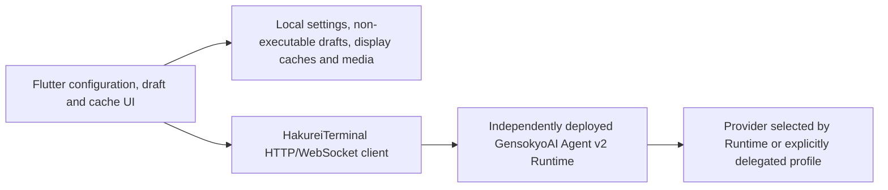

# HakureiTerminal

HakureiTerminal 是独立部署的 GensokyoAI Agent v2 Runtime 的专用 Flutter 前端。GensokyoAI 是可执行角色、聊天会话、消息、上下文、记忆、场景、工具、定时器和生成状态的唯一权威；HakureiTerminal 不包含聊天运行时，也不直接调用模型 Provider 执行生成、Embedding 或工具。用户明确操作时，客户端可直接读取用户配置 Provider 的模型列表和模型元数据。客户端只支持 Runtime 协议主版本 `2`，不兼容 v1，也不接入 `world.*`。

## Downloads

当前公开版本为 [v0.0.1-pre.1 Pre-release](https://github.com/JO-Beacon/HakureiTerminal/releases/tag/v0.0.1-pre.1)：

- Windows x64：下载 `HakureiTerminal-0.0.1+1-windows-x64.zip`，解压后运行 `hakurei_terminal.exe`。
- Android：下载 `HakureiTerminal-0.0.1+1-android-universal.apk`。该 Pre-release 使用 Android Debug 证书，仅适合测试安装。

两个平台都需要用户自行部署并连接 GensokyoAI Runtime `2026.8.8.0`。

客户端只使用 GensokyoAI 的公开 HTTP/WebSocket Runtime 契约。HakureiTerminal 不下载、安装、解包、启动或更新 GensokyoAI，不包含 Python bridge、嵌入式 Python、Chaquopy、本地角色部署逻辑，也不在源码、APK、桌面包、安装器或默认资源中分发 GensokyoAI 源码及其他第三方 Runtime payload。未连接时，应用仍可用于配置、非可执行角色草稿和一次性展示缓存，但不能聊天。

## Architecture


```mermaid
flowchart LR
  UI[Flutter configuration, draft and cache UI] --> LOCAL[Local settings, non-executable drafts, display caches and media]
  UI --> CLIENT[HakureiTerminal HTTP/WebSocket client]
  CLIENT --> EXT[Independently deployed GensokyoAI Agent v2 Runtime]
  EXT --> PROVIDER[Provider selected by Runtime or explicitly delegated profile]
```

- 所有聊天通过 `runtime.info`、`/health`、`/ready`、`/rpc` 和 `/ws` 接入用户明确选择的 GensokyoAI Runtime。客户端不读取服务端磁盘目录或私有配置。
- GensokyoAI 是可执行角色、会话、消息历史、上下文、记忆、场景、工具、定时器、主动事件和生成状态的唯一权威。远端 ID 和展示缓存不构成可编辑或可执行的本地副本。
- 本地客户端创作的角色仅是非可执行草稿。编辑、导入、恢复或启动应用均不会上传草稿。用户可以选择现成的 `.gensokyo-character` 包，经显示目标连接、文件和导入选项的独立确认后调用公开管理员端点；本地草稿不会被隐式转换或上传。
- Runtime 离线、未配置或拒绝请求时，配置、草稿、媒体和缓存 UI 仍可使用，但客户端不能聊天，也不会本地执行或降级到 Provider。

## External Runtime Connection

GensokyoAI 必须由用户或运维方在 HakureiTerminal 之外部署、配置 Provider、保护网络入口并启动。HakureiTerminal 没有本地安装入口。详细迁移步骤见 `docs/external-runtime-migration.md`。

当前连接流程如下：

1. 在“设置 -> 服务管理 -> 外部服务连接”添加显示名称、Runtime 根 URL 和可选 token。保存只写入本地 `settings.json`，不会发起网络请求。
2. 点击“测试连接”。客户端先以 `POST <base>/rpc` 调用 `runtime.info` 读取版本、方法、传输和流协议，再以 `GET <base>/health` 与 `GET <base>/ready` 检查健康和就绪状态。
3. 客户端只接受 `protocol_major_version == 2`，并检查 Agent 生命周期、消息状态、会话、角色发现和 WebSocket v2 ack 所需的公开能力；`world.*` 不属于客户端能力范围。
4. 测试成功后，用户仍需对指定连接执行明确的连接操作。连接只建立 `<base>/ws` 并读取本地已知映射；不会自动初始化角色、恢复会话或扫描其他角色的会话。
5. 每个连接持久化一个客户端生成的 UUID `agent_id`。用户明确选择角色和会话后，客户端以单一串行事务执行 `agent.init`，成功后才用该 `agent_id` 发送 `runtime.subscribe` 并分页读取 Runtime 权威历史及会话 `revision`。
6. 普通管理 RPC 使用 `POST <base>/rpc`。外部消息使用 WebSocket `agent.send_message_stream`，携带显式 `agent_id`、`session_id`、`expected_revision` 和每次操作唯一的 `idempotency_key`；客户端先消费 v2 ack 中的 `stream_id` / `generation_id`，取消使用 `runtime.cancel_stream`。
7. `session.list` 与 `session.messages` 按游标读取全部页面。事件订阅保存最后 `sequence`，重连时以 `after_sequence` 恢复。
8. WebSocket 断开或发送超时后，客户端先用原 `idempotency_key` 调用 `message.status`，再读取 `session.messages` 对账；状态未确认时禁止以新 key 重发。客户端不启动本地服务，也不进行无限自动重试。
9. 图片只在用户按下发送后上传到 `POST <base>/media`，消息引用服务端 `media_id`。角色包只在独立确认后上传到公开 `/character-packages` 管理员端点。

保存连接和应用启动都不会连接，导入 `.jovarchive` 也不会连接：导入会保留 URL 和 token，但断开全部外部连接、清除当前选择和 Provider 委托。每次启动后都需要用户显式执行测试或连接操作。

### URL Policy

- 远程地址必须使用 `https://`，WebSocket 自动使用 `wss://`。
- 仅明确输入的 `http://localhost`、`http://127.0.0.1` 或 `http://[::1]` 可使用明文 HTTP，对应 WebSocket 为 `ws://`。
- 其他 HTTP 地址、非 HTTP(S) scheme、缺少 host 的 URL，以及含 user-info 或 query 参数的 URL会被拒绝。不要把 token 放进 URL。
- 客户端不跟随 HTTP redirect，不扫描端口、不广播发现服务，也不修改 Runtime 的 TLS、CORS、防火墙或监听配置。

### Runtime Token

非空 Runtime token 以 `Authorization: Bearer <token>` 同时附加到 HTTP 和 WebSocket 握手；空 token 不发送认证头。token 保存在本地设置并进入完整 `.jovarchive`，因此两者都必须视为敏感凭据。客户端错误只映射为认证失败、拒绝、资源限制或请求失败等类别，不应回显响应中的秘密。

### Provider Delegation

模型 profile 仅保留用于向用户明确选择的 GensokyoAI Runtime 委托配置；用户也可以在设置中明确刷新 Provider 模型列表和模型元数据。HakureiTerminal 永不使用 Provider 进行生成、Embedding、工具或上下文处理。Runtime 不会因为添加、测试或连接而收到 Provider Key。

用户点击“委托当前模型配置”并确认后，连接只记录被委托的 profile ID。当该 profile 仍是当前 active profile 且外部 Agent 执行 `agent.init` 时，HakureiTerminal 才把主模型及 embedding 的 Provider、模型名、Base URL 和 API Key 作为公开 override 发送给指定 Runtime；生成参数也随主模型 override 发送。授权范围是当前 Runtime 实例，直到服务重启、再次初始化或用户撤销委托。撤销只阻止后续初始化继续发送，并不能从已接收数据的外部进程中远程擦除凭据。HakureiTerminal 不向 GensokyoAI 创建或管理持久 Provider profile。

## Data And Archives

Windows 的主要数据位置为 `%APPDATA%/HakureiTerminal/`；无法使用该位置时，开发 fallback 为仓库工作目录中的 `.hakurei_terminal/` 和 `.hakurei_terminal_settings.json`。

- `settings.json` 包含模型 profile、Provider API Key、外部 Runtime URL/token、委托状态、外观、快捷键和用户角色设置。
- `assistants/` 中的客户端创作内容是非可执行角色草稿；`conversations/` 中的旧本地会话、消息和上下文是惰性遗留数据或一次性展示缓存；`media/` 保存内容寻址媒体。它们都不是 GensokyoAI 执行状态。
- `logs/` 用于本地 `.log` 文件。数据管理页只统计或删除该目录中的 `.log`，不删除设置或存档。
- 完整 `.jovarchive` 包含 `settings/settings.json`，因此包含 Provider API Key 和 Runtime token。导出前会显示敏感凭据提示；不要公开分享归档。
- 导入在本地解析、校验白名单路径和媒体 SHA-256，不联系 Provider 或 Runtime。恢复的外部连接保持断开，直到用户再次明确操作。
- `.jovarchive` 不包含 GensokyoAI 服务端权威的完整角色、会话、消息、上下文、记忆、场景、工具、定时器或配置。归档内的旧本地会话和 Runtime 数据保持惰性，不会自动映射或上传；删除本地连接或本地存档不会删除外部 Runtime 上的数据。

更多数据处理信息见 `PRIVACY.md`，安全报告方式见 `SECURITY.md`。

## Features

- 多模型 profile，仅用于明确委托给选定的 GensokyoAI Runtime。
- 非可执行角色草稿、用户角色、应用设置、媒体和远端展示缓存管理。
- 主题、自定义色板、字体、全局及会话背景、头像和快捷键。
- SHA-256 内容寻址媒体库与跨 Windows/Android 的 `.jovarchive` 导入导出。
- 独立 GensokyoAI Runtime 的外部角色、分页历史、流式 Agent 消息、可恢复事件、语义记忆、场景、主动定时器和图片消息接入。
- 本地存储与日志统计、安全清理。

客户端版本唯一来源是 `pubspec.yaml` 的 `version` 字段。该版本不代表外部 Runtime 版本；连接测试读取 GensokyoAI 返回的 `package_version` 和协议版本。

## Development

需要 Flutter SDK 和平台工具链。从仓库根目录运行：

```cmd
flutter pub get
flutter analyze
flutter test
```

运行 Runtime 边界 scanner 及其测试：

```cmd
python -m unittest -v test_scan_forbidden_runtime_assets.py
python scripts/scan_forbidden_runtime_assets.py source .
```

扫描已构建的目录、ZIP 或 APK：

```cmd
python scripts/scan_forbidden_runtime_assets.py artifact build\windows\x64\runner\Release
python scripts/scan_forbidden_runtime_assets.py artifact build\app\outputs\flutter-apk\app-release.apk
```

Scanner 拒绝 GensokyoAI package/wheel/metadata、旧 bridge 文件、Python runtime 布局、第三方角色/场景和旧默认配置进入受检源码或产物。

### Windows

安装 Visual Studio 的 Desktop development with C++ workload 后可运行：

```cmd
dev_windows.cmd
flutter build windows --release
```

`dev_windows.cmd` 只执行 `flutter run -d windows`。Release 输出位于 `build\windows\x64\runner\Release\`，不需要系统 Python，也不包含 Python runtime。

### Android

安装 Android SDK 和 JDK 17 后运行：

```cmd
flutter build apk --debug
flutter build apk --release
```

调试 APK 位于 `build\app\outputs\flutter-apk\app-debug.apk`。应用 namespace 为 `com.hakureiterminal.hakurei_terminal`。正式发布前须使用项目专用 keystore 配置 release 签名；`android/key.properties` 不应提交。Android 导出默认写入应用外部 files 目录，导入通过系统文件选择器完成。

## License And Contributions

HakureiTerminal 使用 Apache License 2.0。外部互操作软件与 bundled font 的说明见 `THIRD_PARTY_LICENSES.md`。

问题报告、改进建议和需求讨论请提交 GitHub Issue；本仓库不接受 Pull Request。提交前请阅读 `CONTRIBUTING.md`，不要提交 API Key、token、Cookie、密码、个人存档、生产配置、第三方 Runtime 源码或无权公开的素材。GensokyoAI 本体的问题应提交到其上游项目。
