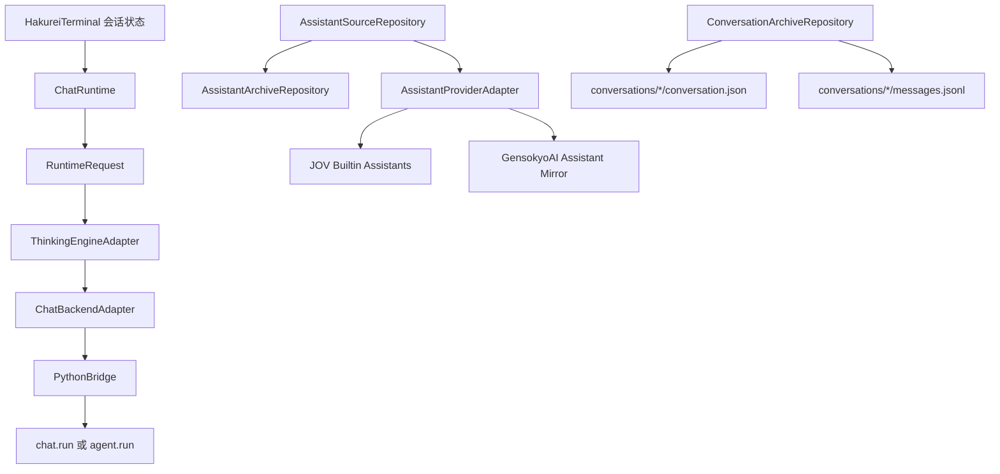

# HakureiTerminal 会话与后端架构重设计变更记录

本文档是 [`session-assistant-backend-redesign-plan.md`](session-assistant-backend-redesign-plan.md) 的实施变更记录，用于追踪从“角色驱动会话”逐步迁移到“会话为数据真相、助手与思考引擎解耦、HakureiTerminal 自管存档”的实际代码进展。

> **历史实施记录：** 本文按实施发生顺序保留中间状态，因此早期章节可能描述后来被删除或替换的代码。带有“当前”“未完成”“下一步”和测试数量的旧段落只代表其所在阶段，不代表仓库现状。当前使用说明和架构边界以 [`README.md`](../README.md) 与现有代码为准。

## 2026-07-17 当前状态补充

- 用户界面术语已统一为“角色”和“运行服务/服务管理”；内部 `Assistant`、`backendId`、`AssistantExecutionBinding` 与对应存档字段保持不变。
- `ChatSession` 当前直接保存会话级 `backendId`、`activeAssistantId` 和 `assistantExecutionBindings`；旧存档缺少 `backend_id` 时会从当前角色绑定迁移运行服务。
- 已删除旧 `ChatRepository` 运行回退路径。HakureiTerminal 会话、消息和上下文由 Dart Repository 直接管理；普通聊天通过 Dart `ChatRuntime` 与 Provider Adapter 执行。
- OpenAI 与 Anthropic 已有独立 Provider Adapter、连接测试、错误归一化和 SSE 流式协议实现；主聊天界面当前仍按非流式 `run()` 路径展示完整结果。
- 设置页用户可见入口为“服务管理”“角色管理”和“数据管理”。数据管理支持全量 `.jovarchive` 导入导出、存档统计，以及仅处理 `.log` 文件的日志统计、目录打开和安全清理。
- 全量 `.jovarchive` 当前包括 `assistants/`、`conversations/` 和 `character_deployments/`，导入使用白名单并拒绝路径穿越；Windows 与 Android 使用相同包格式。
- Android 客户端壳、响应式布局和平台门控已落地。Android 当前只使用 HakureiTerminal 内置 Dart 运行服务，不启动 Python Bridge；设备内嵌 CPython 的后续研究见 [`../20260717.md`](../20260717.md)。
- 正式 Windows 发布仍以 `python scripts/build_windows_release.py` 为唯一入口；阶段性测试数量以当次记录为准，不作为当前测试基线。

## 2026-07-17 架构边界纠正

- HakureiTerminal 的前端、存档层和第一方基础后端统一在 Flutter/Dart 进程内实现；“前端/后端”是产品职责划分，不对应语言或进程边界。
- 移除 Python `JoVecxoraCoreService` 以及 `character.*`、`conversation.*`、`message.*`、`context.*` 存档 RPC；现有本地文件路径与格式保持不变，由 Dart Repository 直接读写。
- Python Bridge 仅服务于可选 GensokyoAI Runtime，包括 Agent、原生角色、角色部署副本和角色包接口；无 GensokyoAI 配置时不启动 Python 进程。
- GensokyoAI 内部 session、记忆和主动触发状态继续由 GensokyoAI 管理，但不作为 HakureiTerminal 会话与消息存档的权威来源。
- HakureiTerminal 与已安装的 GensokyoAI 可以同时处于可用状态；后端配置中的默认值只影响新会话，每个会话单独持久化并选择实际后端。
- 移除主界面顶部和会话列表旁的重复后端状态；会话迷你控制中心改为“选择当前后端”，并让后端与思考引擎保持一致。

## 2026-07-15

### 产品命名与基础后端边界

- 明确产品名称必须完整写作 `HakureiTerminal`，不使用独立的 `JO` 作为简称；既有 `HakureiTerminal`、`jov_builtin`、`.jovarchive` 仅作为技术标识保留。
- 明确 HakureiTerminal 不是纯前端：目标架构包含第一方 HakureiTerminal 基础后端，负责权威业务数据、原生角色资产、基础推演、Provider 接入和外部后端编排。
- 明确外部后端的“推演引擎”和“原生角色生态”是两个独立属性。HakureiTerminal 原生角色可以适配部署到兼容后端，外部后端原生角色默认不跨后端共享。

### 后端术语收敛

- 明确“后端”是可执行的能力提供方，Runtime 只用于运行协议和执行请求语境，不再作为后端之外的产品实体。
- 将 `runtimeBackendId`、`defaultRuntimeBackendId` 无兼容迁移为 `backendId`、`defaultBackendId`，JSON 字段同步改为 `backend_id`、`default_backend_id`。
- 将 `RuntimeBackendAdapter`、`BuiltinChatRuntimeBackend`、`GensokyoAiRuntimeBackend` 改为 `ChatBackendAdapter`、`BuiltinChatBackend`、`GensokyoAiBackend`。
- 将 `AssistantRuntimeBinding` 和 `assistant_runtime_bindings` 改为 `AssistantExecutionBinding` 和 `assistant_execution_bindings`。
- 项目尚未正式发布，因此不读取或双写旧字段，不增加兼容分支。

### HakureiTerminal 基础后端第一阶段

- 新增 `JoVecxoraCoreService`，Python 进程始终先启动 HakureiTerminal 基础后端；GensokyoAI 改为可选挂载能力，未安装时不再阻止基础后端启动。
- 新增独立 `--data-root`，不再从外部后端安装目录反推 HakureiTerminal 权威数据目录。
- 新增 `core.info`、`character.*`、`conversation.*`、`message.*`、`context.*` 稳定 RPC；角色、会话和上下文 JSON 使用同目录临时文件替换，资源 ID 拒绝路径穿越。
- 新增 `backend_character.list`，明确外部后端原生角色与 HakureiTerminal 原生角色是两类资产。
- Flutter 生产路径新增 `CoreAssistantRepository` 和 `CoreConversationRepository`，角色、会话、消息和上下文权威读写改由 HakureiTerminal 基础后端处理；原文件仓储保留给隔离测试和存档导出。
- 会话初始化不再检查外部 Python Provider SDK；基础聊天和权威存档不以 GensokyoAI 或其依赖为前置条件。
- 已安装 GensokyoAI 时启动和设置保存后自动挂载；未安装时状态显示 HakureiTerminal 基础后端可用，不再弹出阻断式安装提示。
- Python 协议测试新增无外部后端持久化、重启恢复、路径安全和基础后端独立可用覆盖。

### 原生角色 sample、角色包与显式部署

- 新增 `character_samples/hakurei_terminal_sample.json` 占位角色资产；基础后端仅在同 ID 角色不存在时初始化，不覆盖用户后续修改。
- `character.create/update` 统一写入 HakureiTerminal 来源与所有权元数据，权威副本继续保存在 `assistants/*.json`。
- 新增 `character_deployment.list/deploy/refresh/remove` RPC；部署记录独立保存在 `character_deployments/<backend-id>/`，并保留来源、作者、许可证、后端版本和目标角色 ID。
- GensokyoAI `2026.7.14.0` 适配新增显式角色部署与移除；`agent.run` 不再为未部署的 HakureiTerminal 角色静默生成文件，而是返回明确错误。
- 新增 `backend_character_package.validate/preview/import`，通过 Runtime 根目录暂存包文件后调用 GensokyoAI 原生 `character_package.*` API，遵守其路径沙箱。
- 设置页角色管理按“HakureiTerminal 原生角色”和“GensokyoAI 原生角色”分区，提供显式部署、移除部署和角色包预览导入入口；冻结旧版不展示新版管理操作。

### GensokyoAI 双版本全局选择

- 冻结 GensokyoAI `2026.5.13.0` 的 Release 元数据与既有适配路径，不再继续演进旧版技术适配。
- 新增 GensokyoAI `2026.7.14.0` Release，使用独立 URL、SHA256、Apache-2.0 许可证和 Runtime 1.1 适配。
- 后端设置新增全局版本选择；两个版本可同时安装到独立版本目录，旧设置按已有 `backend_version` 保持选择旧版，全新设置默认选择新版。
- Python bridge 新增 `--backend-version` 与版本隔离的 `--runtime-root`；切换版本时重启 bridge，不共享两版会话、记忆或配置数据。
- 新版适配启动时通过 `runtime.info` 校验 package version、protocol major 与必需方法，并实现稳定 HakureiTerminal RPC 到 `character.list`、`agent.init`、`agent.send_message` 的转换。
- 新版保存 HakureiTerminal conversation 到 GensokyoAI session 的映射；GensokyoAI session 仅作为 Agent 内部状态，HakureiTerminal 会话仍是产品权威存档。
- 新版真实加载失败时明确报错，不再静默回退为占位 Runtime；旧版回退行为保持不变。
- 内嵌 Python 核心依赖更新为 `ayafileio>=1.4.6`、`ddgs>=9.14.4`。
- 新增设置迁移、双版本目录/清单及 Python 新版协议转换测试。

## 2026-05-16

### 本轮新增进展：思考引擎管理与会话级运行诊断 UX

- 扩展 [`SettingsScreen`](../lib/screens/settings_screen.dart)：
  - 思考引擎页从静态说明升级为引擎状态页，展示 `builtin_chat` 与 `gensokyoai_agent` 的运行后端、是否需要外部后端、当前可用性和能力摘要。
  - 新增助手 × 思考引擎兼容性矩阵，覆盖 HakureiTerminal 内置/本地助手与 GensokyoAI 助手在 `builtin_chat`、`gensokyoai_agent` 下的 `perfect`、`partial`、`unavailable` 诊断文案。
  - 未安装外部后端时，`gensokyoai_agent` 不再从诊断页隐藏，而是明确标记为不可用，便于用户理解“兼容但运行后端缺失”的差异。
- 扩展 [`lib/main.dart`](../lib/main.dart)：
  - 会话级 [`AssistantExecutionBinding`](../lib/models/runtime_capabilities.dart) 初始化时写入结构化 [`CapabilityLoss`](../lib/models/runtime_capabilities.dart) 列表。
  - 右侧会话迷你控制中心新增“运行诊断”卡片，展示初始化来源、用户是否修改和能力损失摘要。
  - `partial` 组合新增明确能力损失规则，例如 GensokyoAI 助手改用 `builtin_chat` 时标注 Agent 流程与三重记忆写回不可用，HakureiTerminal 本地助手改用 `gensokyoai_agent` 时标注缺少原生助手 ID。
- 更新 [`test/widget_test.dart`](../test/widget_test.dart)：
  - 设置页思考引擎测试断言已对齐新的引擎数量、助手类型、引擎卡片和兼容性诊断展示。
- 验证结果：
  - [`dart format`](../pubspec.yaml) 已运行，相关 Dart 文件格式化完成。
  - [`flutter analyze`](../analysis_options.yaml) 已通过，无 analyzer 问题。
  - [`flutter test test/widget_test.dart --plain-name "settings assistant engine and archive pages render"`](../test/widget_test.dart) 已通过。
  - [`flutter test test/archive_repositories_test.dart`](../test/archive_repositories_test.dart) 已通过，4 项测试全部通过。

### 本轮新增进展：设置页助手与存档管理扩展

- 扩展 [`SettingsScreen`](../lib/screens/settings_screen.dart)：
  - 新增可注入的 [`AssistantArchiveRepository`](../lib/repositories/archive_repositories.dart) 与 [`ConversationArchiveRepository`](../lib/repositories/archive_repositories.dart)，便于设置页加载真实本地助手与会话存档数据，并支持 Widget 测试使用临时存档根目录。
  - 助手管理页从只读说明升级为本地助手管理入口：展示本地助手数量、provider 可用状态、刷新状态、空状态、新建入口，以及每个助手的名称、描述、provider、默认思考引擎、默认运行后端和模型覆盖状态。
  - 新增本地助手创建、基础字段编辑与删除确认流程；编辑字段覆盖名称、描述、系统提示词和默认思考引擎，并同步默认运行后端。
  - 存档管理页展示助手文件数、会话目录数和消息文件入口数，并保留 `assistants/*.json`、`conversations/<id>/conversation.json`、`conversations/<id>/messages.jsonl` 的结构说明。
- 新增 `_AssistantManagementTile`，用于集中展示单个本地助手的运行绑定摘要和编辑/删除操作。
- 更新 [`test/widget_test.dart`](../test/widget_test.dart)：
  - 设置页助手/思考引擎/存档页断言已对齐新的助手管理入口文案。
  - 新增临时存档仓储注入场景，验证设置页可以显示本地助手存档数据，并在存档页展示对应助手/会话/消息统计。
- 验证结果：
  - [`flutter analyze`](../pubspec.yaml) 已通过，无 analyzer 问题。
  - [`flutter test test/archive_repositories_test.dart`](../test/archive_repositories_test.dart) 已通过，4 项仓储/Provider 合并测试全部通过。
  - [`flutter test`](../pubspec.yaml) 的完整 Widget 套件在当前 Windows 终端会卡在新增设置页 Widget 测试处，已中止未作为通过结论；当前改动仍以 analyzer 与仓储测试为有效验证基线。

## 2026-05-15

### 已完成：第一阶段领域模型基础

新增和扩展了重设计所需的核心领域模型。

#### 新增助手模型

- 新增 [`Assistant`](../lib/models/assistant.dart)，用于表达助手本体配置，而不是会话状态。
- 新增 [`AssistantProviderId`](../lib/models/assistant.dart)，目前内置：
  - `jov_builtin`
  - `gensokyoai`
- 新增 [`ModelOverride`](../lib/models/assistant.dart)，用于助手级模型覆盖。
- 新增 [`OverrideField`](../lib/models/assistant.dart) 与 [`OverrideFieldMode`](../lib/models/assistant.dart)，支持三态字段：
  - `inherit`：继承全局设置。
  - `override`：使用助手自己的字段值。
  - `clear`：显式清空继承值。

#### 新增运行能力模型

- 新增 [`AssistantEngineCompatibility`](../lib/models/runtime_capabilities.dart)，用于描述助手与思考引擎兼容性：
  - `perfect`
  - `partial`
  - `unavailable`
- 新增 [`CapabilityLoss`](../lib/models/runtime_capabilities.dart)，用于结构化表达部分兼容时的能力损失。
- 新增 [`ThinkingEngine`](../lib/models/runtime_capabilities.dart)，用于描述思考引擎。
- 新增 [`BackendCapability`](../lib/models/runtime_capabilities.dart)，用于描述后端能力。
- 新增 [`AssistantExecutionBinding`](../lib/models/runtime_capabilities.dart)，用于保存会话内某助手实际使用的思考引擎、后端和兼容性。

#### 扩展会话模型

- 扩展 [`ChatSession`](../lib/models/chat_session.dart)：
  - 从旧的 `characterId` 绑定模型迁移到更接近会话元信息的结构。
  - 新增 `title`、`activeAssistantId`、`summary`、`metadata` 等字段。
  - 保留 `sessionId`、`totalTurns`、`createdAt`、`lastActive` 等已有可用字段。

#### 扩展消息模型

- 扩展 [`ChatMessage`](../lib/models/chat_message.dart)：
  - 新增 `conversationId`。
  - 新增 `assistantId`。
  - 新增 `thinkingEngineId`。
  - 新增 `backendId`。
  - 新增 `assistantProviderId`。
  - 新增 `compatibility`。
  - 新增 `capabilityLosses`。
  - 新增 `modelResolved`。
  - 新增 `status`、`parentMessageId`、`metadata`。
- [`ChatMessage`](../lib/models/chat_message.dart) 现在可记录每条 assistant 消息实际使用的助手、思考引擎、后端和模型快照。

#### 保持设置兼容

- 修复并保持 [`AppSettings`](../lib/models/app_settings.dart) 兼容现有设置页和测试。
- 保留现有模型配置档案能力。
- 保留后端安装配置字段。
- 修复桥接初始化参数：
  - `model_overrides`
  - `embedding_overrides`
- 保留 OpenAI-Compatible base URL 归一化逻辑。

### 已完成：第二阶段运行层抽象

新增统一运行层，使普通聊天和 GensokyoAI Agent 可以通过相同请求结构被上层调用。

#### 新增运行请求模型

- 新增 [`RuntimeRequest`](../lib/services/runtime/runtime_request.dart)，统一表达一次运行请求。
- 新增 [`RuntimeMessage`](../lib/services/runtime/runtime_request.dart)，用于传递会话历史。
- 新增 [`ResolvedModelSettings`](../lib/services/runtime/runtime_request.dart)，用于保存解析后的实际模型设置快照。

[`RuntimeRequest`](../lib/services/runtime/runtime_request.dart) 当前包含：

- `conversationId`
- `assistantId`
- `assistantProviderId`
- `providerAssistantId`
- `thinkingEngineId`
- `backendId`
- `systemPrompt`
- `messages`
- `model`
- `memoryContext`
- `options`

#### 新增运行响应模型

- 新增 [`RuntimeReply`](../lib/services/runtime/runtime_reply.dart)，统一表达后端返回的运行结果。
- 支持字段：
  - `content`
  - `thoughtSummary`
  - `memoryPatches`
  - `capabilityLosses`
  - `metadata`

#### 新增适配接口

- 新增 [`ChatBackendAdapter`](../lib/services/runtime/backend_adapters.dart)。
- 新增 [`ThinkingEngineAdapter`](../lib/services/runtime/backend_adapters.dart)。
- 新增 [`BuiltinChatBackend`](../lib/services/runtime/backend_adapters.dart)。
- 新增 [`GensokyoAiBackend`](../lib/services/runtime/backend_adapters.dart)。
- 新增 [`BuiltinChatThinkingEngineAdapter`](../lib/services/runtime/backend_adapters.dart)。
- 新增 [`GensokyoAiAgentThinkingEngineAdapter`](../lib/services/runtime/backend_adapters.dart)。

#### 新增模型解析器

- 新增 [`ModelProviderResolver`](../lib/services/runtime/model_provider_resolver.dart)。
- 支持按字段解析助手级模型覆盖。
- 支持继承、覆盖、清空三态。
- 解析结果写入 [`ResolvedModelSettings`](../lib/services/runtime/runtime_request.dart)。

#### 新增统一聊天运行门面

- 新增 [`ChatRuntime`](../lib/services/runtime/chat_runtime.dart)。
- [`ChatRuntime`](../lib/services/runtime/chat_runtime.dart) 负责：
  - 接收 HakureiTerminal 会话状态。
  - 读取助手系统提示词。
  - 转换历史消息为 [`RuntimeMessage`](../lib/services/runtime/runtime_request.dart)。
  - 解析最终模型配置。
  - 组装 [`RuntimeRequest`](../lib/services/runtime/runtime_request.dart)。
  - 路由到对应 [`ThinkingEngineAdapter`](../lib/services/runtime/backend_adapters.dart)。

### 已完成：builtin_chat 普通聊天路径骨架

- [`BuiltinChatThinkingEngineAdapter`](../lib/services/runtime/backend_adapters.dart) 已实现兼容性判断：
  - HakureiTerminal 内置助手 + `builtin_chat`：`perfect`。
  - GensokyoAI 助手 + `builtin_chat`：`partial`。
- [`BuiltinChatBackend`](../lib/services/runtime/backend_adapters.dart) 通过 [`PythonBridge.call()`](../lib/services/python_bridge.dart) 调用 `chat.run`。
- [`ChatRuntime.buildRequest()`](../lib/services/runtime/chat_runtime.dart) 已支持从 HakureiTerminal 状态组装普通聊天请求。

> 当前 `chat.run` 是前端运行层协议入口，后续仍需在 Python 侧或内置模型调用层补齐实际 provider 调用实现。

### 已完成：第三阶段 GensokyoAI 适配入口

#### GensokyoAI Agent 后端入口

- [`GensokyoAiBackend`](../lib/services/runtime/backend_adapters.dart) 已通过 [`PythonBridge.call()`](../lib/services/python_bridge.dart) 调用 `agent.run`。
- [`GensokyoAiAgentThinkingEngineAdapter`](../lib/services/runtime/backend_adapters.dart) 已实现兼容性判断：
  - GensokyoAI 助手 + `gensokyoai_agent`：`perfect`。
  - HakureiTerminal 内置助手 + `gensokyoai_agent`：`partial`。

#### GensokyoAI 助手提供方

- 新增 [`AssistantProviderAdapter`](../lib/services/runtime/assistant_provider_adapters.dart)。
- 新增 [`JovBuiltinAssistantProviderAdapter`](../lib/services/runtime/assistant_provider_adapters.dart)。
- 新增 [`GensokyoAiAssistantProviderAdapter`](../lib/services/runtime/assistant_provider_adapters.dart)。
- [`GensokyoAiAssistantProviderAdapter`](../lib/services/runtime/assistant_provider_adapters.dart) 支持将 GensokyoAI 原生助手 payload 映射为 HakureiTerminal 的 [`Assistant`](../lib/models/assistant.dart) 镜像。
- GensokyoAI 助手镜像默认设置：
  - `providerId = gensokyoai`
  - `defaultThinkingEngineId = gensokyoai_agent`
  - `defaultBackendId = gensokyoai`
  - `providerAssistantId` 保留原生助手 ID。

### 已完成：本地存档抽象

新增 [`archive_repositories.dart`](../lib/repositories/archive_repositories.dart)，开始落地 HakureiTerminal 自管存档体系。

#### 存档路径

- 新增 [`ArchivePaths`](../lib/repositories/archive_repositories.dart)。
- 默认 Windows 路径为 `%APPDATA%/HakureiTerminal`。
- 非 Windows 或测试环境可使用 `.hakurei_terminal` 或注入临时目录。

#### 助手仓储

- 新增 [`AssistantArchiveRepository`](../lib/repositories/archive_repositories.dart)。
- 支持：
  - `listAssistants()`
  - `getAssistant()`
  - `saveAssistant()`
  - `deleteAssistant()`
- 每个助手保存为独立 JSON 文件。

#### 会话仓储

- 新增 [`ConversationArchiveRepository`](../lib/repositories/archive_repositories.dart)。
- 支持：
  - `saveConversation()`
  - `getConversation()`
  - `listConversations()`
  - `appendMessage()`
  - `listMessages()`
  - `deleteConversation()`
- 会话元信息保存到 `conversation.json`。
- 消息流保存到 `messages.jsonl`。

### 已新增测试

#### 运行层测试

新增 [`runtime_test.dart`](../test/runtime_test.dart)：

- 测试 [`ModelProviderResolver`](../lib/services/runtime/model_provider_resolver.dart) 的字段级覆盖解析。
- 测试 [`ChatRuntime.buildRequest()`](../lib/services/runtime/chat_runtime.dart) 能从 HakureiTerminal 会话状态组装 `builtin_chat` 请求。
- 测试 [`ChatRuntime.run()`](../lib/services/runtime/chat_runtime.dart) 能通过选中的思考引擎调用后端。

#### 存档与 GensokyoAI 助手镜像测试

新增 [`archive_repositories_test.dart`](../test/archive_repositories_test.dart)：

- 测试 [`AssistantArchiveRepository`](../lib/repositories/archive_repositories.dart) 的助手保存、读取、列表和删除。
- 测试 [`ConversationArchiveRepository`](../lib/repositories/archive_repositories.dart) 的会话元信息和 `jsonl` 消息存储。
- 测试 [`GensokyoAiAssistantProviderAdapter`](../lib/services/runtime/assistant_provider_adapters.dart) 能把 GensokyoAI 原生助手 payload 映射为 HakureiTerminal 助手镜像。

### 验证结果

当前代码通过：

- `flutter analyze`
- `flutter test`

测试总数：21 个测试全部通过。

## 当前未完成事项

### UI 会话优先改造

尚未开始第四阶段 UI 重做：

- 会话列表优先。
- 会话迷你控制中心。
- 助手切换。
- 思考引擎切换。
- 兼容性等级展示。
- 模型解析结果展示。
- GensokyoAI 记忆可视化与编辑入口。

## 当前架构状态概览

当前代码已经从单纯角色驱动调用，推进到以下中间形态：

## 本轮新增进展

### Python bridge 协议占位

- [`bridge_main.py`](../bridge_main.py) 和 [`assets/python/bridge_main.py`](../assets/python/bridge_main.py) 已新增本地占位运行服务。
- 在外部 GensokyoAI 后端不可用时，bridge 会回退到本地占位服务，而不是直接启动失败。
- 本地占位服务已支持：
  - `assistant.list`
  - `chat.run`
  - `agent.run`
  - 旧接口兼容占位：`list_characters`、`init`、`list_sessions`、`send_message`
- [`scripts/prepare_client_python_assets.py`](../scripts/prepare_client_python_assets.py) 已删除不存在的 `characters` 复制项，避免准备资源时依赖不存在目录。

### 助手来源聚合

- 新增 [`AssistantSourceRepository`](../lib/services/runtime/assistant_provider_adapters.dart)，统一聚合本地 [`AssistantArchiveRepository`](../lib/repositories/archive_repositories.dart) 与多个 [`AssistantProviderAdapter`](../lib/services/runtime/assistant_provider_adapters.dart)。
- 聚合规则为本地助手优先，provider 助手作为补充来源。
- 新增测试验证本地助手与 provider 助手合并、去重和本地优先策略。

### 验证结果

当前代码通过：

- `python -m py_compile bridge_main.py assets/python/bridge_main.py scripts/prepare_client_python_assets.py`
- `flutter test`
- `flutter analyze`

测试总数：22 个测试全部通过。

## 本轮新增进展：助手聚合与会话级选择器

### 主界面接入助手聚合列表

- [`lib/main.dart`](../lib/main.dart) 已接入 [`AssistantSourceRepository`](../lib/services/runtime/assistant_provider_adapters.dart)，主界面启动后会聚合本地助手与 provider 助手。
- 内置助手与 provider 助手统一进入主界面的助手列表，供会话迷你控制中心选择。
- 当外部 provider 不可用时，仍保留本地内置助手占位，避免列表为空。

### 会话级助手选择状态

- 会话迷你控制中心新增助手下拉选择器。
- 选择助手后会更新当前会话的 `activeAssistantId`。
- 当前会话与会话列表条目会同步展示已选择助手的名称。
- 目前只落地“助手选择与会话状态更新”切片，消息发送链路保持不变。

### 会话级绑定占位

- [`lib/main.dart`](../lib/main.dart) 已为每个会话维护 `AssistantExecutionBinding` 占位映射。
- 当助手首次被选中时，会根据其默认思考引擎与默认运行后端创建初始绑定。
- 当前兼容性先按助手默认引擎做静态判定，并在控制中心展示实际引擎与兼容性占位。

### UI 展示增强

- 右侧控制中心已展示：
  - 当前助手名称。
  - 助手来源。
  - 默认思考引擎。
  - 当前会话实际引擎。
  - 兼容性等级。
  - 模型解析预览占位。
- 新增内置助手占位名称常量，便于测试和 UI 断言。

### Widget 测试更新

- [`test/widget_test.dart`](../test/widget_test.dart) 已更新，覆盖会话列表、会话迷你控制中心和助手选择器相关文案。

### 验证结果

当前代码通过：

- [`flutter analyze`](../lib/main.dart:1)
- [`flutter test`](../test/widget_test.dart:1)

测试总数：22 个测试全部通过。

## 本轮新增进展：会话级绑定持久化与运行时联通

### 会话级绑定持久化

- [`ChatSession`](../lib/models/chat_session.dart) 新增 `assistantRuntimeBindings` 显式字段。
- 会话存档 `conversation.json` 现在会序列化并反序列化每个助手在该会话内的 `AssistantExecutionBinding`。
- [`lib/main.dart`](../lib/main.dart) 在选择助手、创建本地会话、发送消息后会通过 [`ConversationArchiveRepository`](../lib/repositories/archive_repositories.dart) 保存会话元信息。
- 用户消息与 assistant 回复会追加写入本地 `messages.jsonl`。

### 发送链路接入 ChatRuntime

- [`lib/main.dart`](../lib/main.dart) 已初始化 [`ChatRuntime`](../lib/services/runtime/chat_runtime.dart)，并注册：
  - `builtin_chat`
  - `gensokyoai_agent`
- 当当前会话已选择助手且存在绑定时，发送消息会走 [`ChatRuntime.run()`](../lib/services/runtime/chat_runtime.dart)。
- 当未选择助手或没有绑定时，仍保留旧的 [`ChatRepository.sendMessage()`](../lib/repositories/chat_repository.dart) 回退路径。
- assistant 消息现在会写入：
  - `assistantId`
  - `assistantProviderId`
  - `thinkingEngineId`
  - `backendId`
  - `compatibility`
  - `capabilityLosses`
  - `modelResolved`

### 测试更新

- [`archive_repositories_test.dart`](../test/archive_repositories_test.dart) 已覆盖会话级 `assistantRuntimeBindings` 存档读写。
- [`runtime_test.dart`](../test/runtime_test.dart) 继续覆盖 [`ChatRuntime.buildRequest()`](../lib/services/runtime/chat_runtime.dart) 和 [`ChatRuntime.run()`](../lib/services/runtime/chat_runtime.dart)。
- [`widget_test.dart`](../test/widget_test.dart) 继续覆盖会话优先主界面和设置页基础渲染。

### 验证结果

当前代码通过：

- [`flutter analyze`](../lib/main.dart:1)
- [`flutter test`](../test/widget_test.dart:1)

测试总数：22 个测试全部通过。

## 本轮新增进展：右侧控制中心与消息快照可视化

### 右侧控制中心增强

- [`lib/main.dart`](../lib/main.dart) 的会话迷你控制中心已补齐：
  - 系统提示词预览。
  - 会话绑定详情。
  - 模型解析预览。
  - 基础记忆面板占位。
- 当前右侧控制中心可直观看到当前助手、助手来源、默认思考引擎、当前运行后端与兼容性状态。
- 会话绑定详情和模型解析预览已经和当前选择的助手绑定到一起，供后续编辑/恢复默认继续扩展。

### 消息快照可视化

- assistant 消息气泡已展示消息快照标签：
  - 助手 ID。
  - 思考引擎 ID。
  - 运行后端 ID。
  - 兼容性等级。
  - 模型解析快照中的 provider 与 model。
- 这样可以在聊天区直接确认本次消息是由哪个助手、哪套运行链路生成。

### 测试更新

- [`test/widget_test.dart`](../test/widget_test.dart) 已更新，覆盖右侧控制中心新增文案与消息快照基础渲染。

### 验证结果

当前代码通过：

- [`flutter analyze`](../lib/main.dart:1)
- [`flutter test`](../test/widget_test.dart:1)

测试总数：22 个测试全部通过。

## 本轮新增进展：右侧控制中心绑定编辑

### 思考引擎覆盖与运行后端同步

- [`lib/main.dart`](../lib/main.dart) 的会话迷你控制中心新增“会话绑定编辑”卡片。
- 卡片中新增“覆盖思考引擎”下拉，用于修改当前会话内当前助手的实际思考引擎。
- 修改思考引擎后会重新计算对应运行后端：
  - `builtin_chat` 对应 `hakurei_terminal`。
  - `gensokyoai_agent` 对应 `gensokyoai`。
- 修改后会同步更新当前会话的 `assistantRuntimeBindings`，并继续通过 [`ConversationArchiveRepository`](../lib/repositories/archive_repositories.dart) 保存会话元信息。

### 恢复默认绑定

- 右侧控制中心新增“恢复默认绑定”按钮。
- 恢复默认时会重新使用当前助手的 `defaultThinkingEngineId` 与默认运行后端生成会话级绑定。
- 用户覆盖后的绑定会标记 `userModified = true`，恢复默认后回到 `initializedFromDefault = true` 与 `userModified = false`。

### UI 与测试修正

- 绑定编辑卡片显示 assistant、engine、backend、compat、default、modified 状态芯片，便于确认当前会话实际运行配置。
- 思考引擎下拉启用 `isExpanded` 与文本省略，避免窄侧栏下出现布局溢出。
- [`test/widget_test.dart`](../test/widget_test.dart) 已覆盖右侧控制中心绑定编辑文案，并扩大测试画布以验证完整右侧控制中心渲染。

### 验证结果

当前代码通过：

- [`flutter analyze`](../lib/main.dart:1)
- [`flutter test`](../test/widget_test.dart:1)

测试总数：22 个测试全部通过。

## 本轮新增进展：助手模型覆盖编辑

### 右侧控制中心新增模型覆盖入口

- [`lib/main.dart`](../lib/main.dart) 的右侧会话迷你控制中心新增“模型覆盖编辑”卡片。
- 卡片展示当前助手 `ModelOverride` 的启用状态与核心字段覆盖状态：
  - provider
  - model
  - baseUrl
  - temperature
  - stream
  - reasoningEffort
- 新增“编辑模型覆盖”按钮，弹窗中可启用/关闭助手级模型覆盖。

### 模型覆盖字段与持久化

- 本切片优先支持编辑助手本体的模型覆盖，而不是新增会话级模型覆盖字段。
- 弹窗支持编辑 provider、model、baseUrl、temperature、stream、reasoningEffort。
- 暂不暴露 apiKey 等敏感字段。
- 空文本字段表示继承全局配置，stream 支持继承、覆盖开启、覆盖关闭和显式清空。
- 保存后会更新当前 [`Assistant`](../lib/models/assistant.dart)，并通过 [`AssistantArchiveRepository.saveAssistant()`](../lib/repositories/archive_repositories.dart) 持久化本地助手。
- [`ChatRuntime.buildRequest()`](../lib/services/runtime/chat_runtime.dart) 会继续复用当前助手的 `modelOverride`，因此模型解析预览和后续发送链路会自动使用更新后的覆盖结果。

### 测试更新

- [`test/runtime_test.dart`](../test/runtime_test.dart) 新增关闭覆盖时保持全局模型设置不变的断言。
- [`test/widget_test.dart`](../test/widget_test.dart) 更新右侧控制中心基础渲染断言，覆盖模型覆盖编辑入口文案。

### 验证结果

当前代码通过：

- [`flutter analyze`](../lib/main.dart:1)
- [`flutter test`](../test/widget_test.dart:1)

测试总数：23 个测试全部通过。

## 本轮新增进展：设置页管理入口概览

### 设置页导航扩展

- [`SettingsInitialPage`](../lib/screens/settings_screen.dart) 新增：
  - `assistantManagement`
  - `thinkingEngines`
  - `archives`
- 设置页内部导航新增三项：
  - 助手管理
  - 思考引擎
  - 存档管理
- 设置页控制中心说明已从模型/后端扩展到模型、助手、思考引擎、存档、本地后端和应用信息。

### 只读概览页

- 助手管理页展示：
  - 本地助手存档 `assistants/*.json`。
  - Provider 助手来源聚合。
  - 当前编辑入口仍在会话迷你控制中心。
- 思考引擎页展示：
  - `builtin_chat` 与 `hakurei_terminal`。
  - `gensokyoai_agent` 与 `gensokyoai`。
  - `perfect`、`partial`、`unavailable` 兼容性规则。
- 存档管理页展示：
  - `assistants/*.json`。
  - `conversations/<id>/conversation.json`。
  - `conversations/<id>/messages.jsonl`。

### 测试更新

- [`test/widget_test.dart`](../test/widget_test.dart) 新增设置页助手管理、思考引擎和存档管理入口渲染测试。

### 验证结果

当前代码通过：

- [`flutter analyze`](../lib/main.dart:1)
- [`flutter test`](../test/widget_test.dart:1)

测试总数：24 个测试全部通过。

## 本轮新增进展：消息快照悬浮解释增强

### 快照标签增强

- [`lib/main.dart`](../lib/main.dart) 中 assistant 消息的快照标签已从普通 `Chip` 升级为带 `Tooltip` 的解释型标签。
- 快照标签现在展示：
  - 助手 ID。
  - 助手来源 Provider。
  - 思考引擎 ID。
  - 运行后端 ID。
  - 兼容性等级。
  - 模型 provider。
  - 模型名。
  - 能力损失数量。

### 悬浮解释

- 兼容性标签提供 `perfect`、`partial`、`unavailable` 的解释。
- 能力损失标签会显示本条回复记录的能力损失数量。
- 如果存在能力损失，会优先展示能力损失标题或 code 摘要。

### 测试更新

- [`test/widget_test.dart`](../test/widget_test.dart) 新增消息快照标签测试，覆盖助手来源、能力损失数量和兼容性 Tooltip 文案。
- 为测试暴露了 [`MessageSnapshotTestHost`](../lib/main.dart)，只用于验证消息快照 UI。

### 验证结果

当前代码通过：

- [`flutter analyze`](../lib/main.dart:1)
- [`flutter test`](../test/widget_test.dart:1)

测试总数：25 个测试全部通过。

## 本轮新增进展：三层模型覆盖落地

### 会话级模型覆盖字段

- [`AssistantExecutionBinding`](../lib/models/runtime_capabilities.dart) 新增 `modelOverride` 字段。
- 会话级 `modelOverride` 使用与助手本体相同的 [`ModelOverride`](../lib/models/assistant.dart) 结构。
- 语义明确为“当前会话中该助手的运行模型覆盖”，不会修改 [`Assistant.modelOverride`](../lib/models/assistant.dart)。
- [`ConversationArchiveRepository`](../lib/repositories/archive_repositories.dart) 通过 [`ChatSession`](../lib/models/chat_session.dart) 的 `assistantRuntimeBindings` 自动保存并恢复会话级模型覆盖。

### 模型解析规则更新

- [`ModelProviderResolver`](../lib/services/runtime/model_provider_resolver.dart) 已从“全局 + 助手级”两层解析升级为三层解析：
  1. 全局模型设置。
  2. 助手本体模型覆盖。
  3. 会话级模型覆盖。
- 最终优先级固定为：**会话级模型覆盖 > 助手本体模型覆盖 > 全局模型设置**。
- 字段级三态语义保持不变：
  - `inherit`：继承上一层解析结果。
  - `override`：使用当前层字段值。
  - `clear`：显式清空上一层字段。
- `extra` 会按层级合并，后层覆盖前层同名键。

### 运行请求与消息快照

- [`ChatRuntime.run()`](../lib/services/runtime/chat_runtime.dart) 和 [`ChatRuntime.buildRequest()`](../lib/services/runtime/chat_runtime.dart) 新增会话级模型覆盖输入。
- 主发送链路会把当前 [`AssistantExecutionBinding.modelOverride`](../lib/models/runtime_capabilities.dart) 传入运行时。
- 消息 `modelResolved` 快照现在记录三层解析后的最终模型配置。
- 模型解析预览也使用同一套三层解析结果，避免预览与实际发送不一致。

### 右侧控制中心 UI 更新

- “模型覆盖编辑”卡片现在区分两个入口：
  - “编辑助手本体覆盖”：修改助手跨会话默认模型偏好。
  - “编辑会话级覆盖”：只修改当前会话中当前助手的运行模型。
- 控制中心同时展示助手本体覆盖与当前会话覆盖的启用状态和字段覆盖状态。
- 编辑弹窗文案已区分助手级与会话级语义，避免用户误以为会话级设置会永久修改助手本体。

### 测试更新

- [`test/runtime_test.dart`](../test/runtime_test.dart) 新增三层覆盖优先级测试，验证会话级覆盖优先于助手级覆盖，助手级覆盖优先于全局设置。
- [`test/archive_repositories_test.dart`](../test/archive_repositories_test.dart) 新增会话级 `modelOverride` 存档读写断言。
- [`test/widget_test.dart`](../test/widget_test.dart) 更新右侧控制中心文案断言，覆盖“编辑助手本体覆盖”和“编辑会话级覆盖”。

### 验证结果

当前代码通过：

- [`flutter test`](../test/runtime_test.dart:1)

测试总数：26 个测试全部通过。

## 本轮新增进展：UI 交互测试与控制中心收口

### Widget 交互测试补强

- [`test/widget_test.dart`](../test/widget_test.dart) 新增会话优先主界面的细粒度交互测试：
  - 创建本地会话后选择默认助手，并验证会话级 [`AssistantExecutionBinding`](../lib/models/runtime_capabilities.dart) 初始化结果。
  - 覆盖思考引擎为 `gensokyoai_agent` 后验证 engine、backend、compat 和 modified 状态芯片同步更新。
  - 恢复默认绑定后验证重新回到 `builtin_chat`、`hakurei_terminal`、`perfect` 和未修改状态。
  - 验证助手本体模型覆盖与会话级模型覆盖会推动“最终来源”摘要从全局配置切换到助手本体覆盖，再切换到当前会话覆盖。
  - 验证紧凑高度下右侧控制中心滚动区域仍可访问基础记忆面板。
- 为测试新增 [`ChatScreenController`](../lib/main.dart)，仅用于 Widget 测试中直接驱动创建会话、选择助手、切换思考引擎、恢复默认绑定和保存模型覆盖，避免测试依赖下拉菜单动画细节。

### 控制中心 UX 修正

- [`lib/main.dart`](../lib/main.dart) 的助手选择器启用 `isExpanded`，并为助手选项和未挂载提示增加文本省略，修复窄侧栏下助手名称与 provider 标签导致的横向溢出。
- 右侧“模型覆盖编辑”卡片新增模型解析来源摘要：
  - `最终来源: 全局模型配置`
  - `最终来源: 助手本体覆盖`
  - `最终来源: 当前会话覆盖`
- 选择助手时如果当前助手列表尚未包含内置默认助手，会自动补入内置助手列表，保证测试和 UI 状态一致。

### 验证结果

当前代码通过：

- [`flutter analyze`](../analysis_options.yaml)
- [`flutter test`](../test/widget_test.dart)

测试总数：30 个测试全部通过。

## 本轮新增进展：builtin_chat 真实 provider 调用与发送前校验

### Dart 侧普通聊天 Provider 客户端

- 新增 [`lib/services/runtime/builtin_chat_provider.dart`](../lib/services/runtime/builtin_chat_provider.dart)：
  - 新增 [`ChatProviderClient`](../lib/services/runtime/builtin_chat_provider.dart) 抽象，后续可继续扩展 DeepSeek、OpenRouter、Ollama 或其他 OpenAI-Compatible provider。
  - 新增 [`OpenAiCompatibleChatProviderClient`](../lib/services/runtime/builtin_chat_provider.dart)，通过 Dart `HttpClient` 直接调用 `chat/completions`，请求体注入系统提示词、HakureiTerminal 会话历史和三层解析后的模型参数。
  - 新增 [`BuiltinChatModelValidator`](../lib/services/runtime/builtin_chat_provider.dart)，发送前校验 provider、model、apiKey、baseUrl、timeout 等必要配置。
  - 新增 [`ModelAvailabilityReport`](../lib/services/runtime/builtin_chat_provider.dart)，用结构化 [`CapabilityLoss`](../lib/models/runtime_capabilities.dart) 表达模型配置不可用原因。

### builtin_chat 运行后端切换

- [`BuiltinChatBackend`](../lib/services/runtime/backend_adapters.dart) 已从 Python bridge 占位 `chat.run` 路径切换为 Dart 侧 provider client 调用。
- 配置不可用时不再进入真实 provider 请求，而是返回带 `blocked=true` 元数据和结构化能力损失的 [`RuntimeReply`](../lib/services/runtime/runtime_reply.dart)。
- Provider HTTP 调用失败时会归一化为 `builtin_chat_provider_error` 能力损失，方便 UI 展示修复方向。

### 会话级运行诊断与发送阻断

- [`lib/main.dart`](../lib/main.dart) 的右侧“运行诊断”和“模型解析预览”已展示模型可用性摘要。
- 发送按钮现在不再依赖“外部后端已安装”作为 `builtin_chat` 的前置条件；内置普通聊天只依赖模型配置校验。
- 当当前会话未选择助手、绑定不可用或模型配置缺失时，发送链路会阻止请求，并在错误横幅中提示需要修复的结构化诊断。

### 测试与验证

- [`test/runtime_test.dart`](../test/runtime_test.dart) 新增：
  - 模型配置缺失时阻止 `builtin_chat` provider client 调用。
  - 模型配置有效时通过注入 [`ChatProviderClient`](../lib/services/runtime/builtin_chat_provider.dart) 执行并记录请求。
- 验证结果：
  - [`dart format`](../pubspec.yaml) 已运行，相关 Dart 文件格式化完成。
  - [`flutter test test/runtime_test.dart`](../test/runtime_test.dart) 已通过，7 项测试全部通过。

## 本轮新增进展：上下文存档、provider 覆盖面与 jovarchive 导出基础

### 会话上下文存档基础

- 扩展 [`ArchivePaths`](../lib/repositories/archive_repositories.dart)：
  - 新增 `context.json` 路径。
  - 新增 `archives/*.jovarchive` 路径。
- 新增 [`ConversationContextState`](../lib/repositories/archive_repositories.dart)，用于保存：
  - 会话摘要 `summary`。
  - 当前请求纳入消息数 `includedMessageCount`。
  - 裁剪边界 `truncatedBeforeMessageId`。
  - 裁剪策略与其他上下文元数据 `metadata`。
- 扩展 [`ConversationArchiveRepository`](../lib/repositories/archive_repositories.dart)：
  - 新增 `saveContext()`。
  - 新增 `getContext()`。

### 普通聊天 provider 覆盖面与诊断增强

- 扩展 [`builtin_chat_provider.dart`](../lib/services/runtime/builtin_chat_provider.dart)：
  - 新增 provider canonical id 归一化。
  - 新增 provider profile 表，覆盖 OpenAI、DeepSeek、OpenRouter、OpenAI-Compatible、Ollama、LM Studio、本地 OpenAI-Compatible。
  - OpenAI、DeepSeek、OpenRouter 已具备默认 endpoint。
  - Ollama 与 LM Studio 默认不要求 API Key，并提供本地默认 endpoint。
  - OpenAI-Compatible 与 local provider 明确要求手动填写 Base URL。
  - OpenRouter 请求会自动补充 `HTTP-Referer` 与 `X-Title` 头。
- [`BuiltinChatModelValidator`](../lib/services/runtime/builtin_chat_provider.dart) 现在根据 provider profile 判断是否需要 API Key 与 Base URL，避免把本地 provider 误判为远程 API。

### .jovarchive 会话导出基础

- 新增 [`JovArchiveExportRepository`](../lib/repositories/archive_repositories.dart)。
- 当前支持导出单个会话为 `.jovarchive` zip 包，包含：
  - `manifest.json`。
  - `conversations/<id>/conversation.json`。
  - `conversations/<id>/messages.jsonl`。
  - `conversations/<id>/context.json`。
- 当前先完成导出基础，导入、冲突处理、助手导出和全量备份恢复后续继续扩展。

### 测试与验证

- [`test/archive_repositories_test.dart`](../test/archive_repositories_test.dart) 新增上下文存档与 `.jovarchive` 导出结构测试。
- [`test/runtime_test.dart`](../test/runtime_test.dart) 新增本地 provider 无 API Key 也可通过校验、OpenAI-Compatible 缺 Base URL 会被阻止的断言。
- 验证结果：
  - [`dart format`](../pubspec.yaml) 已运行，相关 Dart 文件格式化完成。
  - [`flutter test test/archive_repositories_test.dart`](../test/archive_repositories_test.dart) 已通过，5 项测试全部通过。
  - [`flutter test test/runtime_test.dart`](../test/runtime_test.dart) 已通过，8 项测试全部通过。

## 下一步建议

优先顺序建议：

1. 落地 GensokyoAI 三重记忆存档与 UI，包括待确认建议、用户编辑、禁用、删除和冲突处理。
2. 实现上下文摘要生成与按模型上下文窗口裁剪历史，而不仅是保存 `context.json` 状态。
3. 扩展 `.jovarchive` 导入、校验、冲突处理、助手导出和全量备份恢复。
4. 最后接入真实 GensokyoAI `assistant.list` 与 `agent.run`，替换外部后端占位路径。
