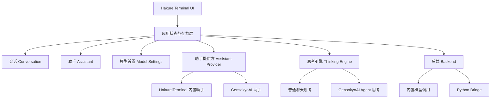
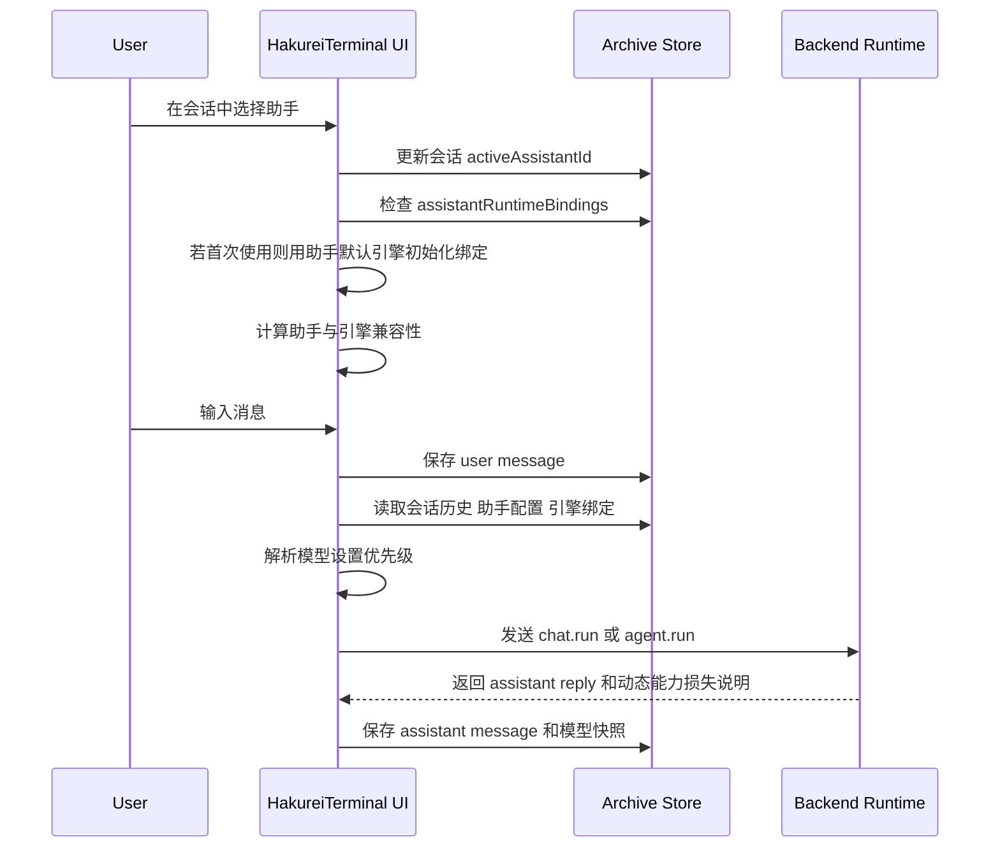

# HakureiTerminal 会话与后端架构重设计计划

> **历史设计文档：** 本文记录重设计提出时的术语、问题判断、目标模型和分阶段实施过程，其中部分“当前代码”“下一步”和测试数量已经过时。当前产品行为、平台边界、构建方式和目录结构以仓库根目录 [`README.md`](../README.md) 与现有代码为准；实际实施历史见 [`session-assistant-backend-redesign-changelog.md`](session-assistant-backend-redesign-changelog.md)。
>
> 本文中的“助手”“后端”和 `assistant*`、`backend*` 在很多位置属于历史领域模型或内部工程标识。当前用户界面统一使用“角色”和“运行服务/服务管理”，但内部 `Assistant`、`backendId`、`AssistantExecutionBinding` 及存档字段不因此重命名。

## 1. 核心结论

本次系统架构改造的核心方向是：**HakureiTerminal 成为唯一的会话、上下文和存档管理方；助手和思考引擎拆开建模；助手只提供默认思考引擎；第一次在某个会话中使用助手时写入会话级选择，之后该会话保存用户对助手与引擎组合的实际选择；新会话默认生成一个可见的默认助手占位，但不自动绑定到任何会话，用户必须显式选择；普通聊天能力也应拥有自己的内置后端，provider 配置只是这个内置后端的输入，而不是后端本身。**

### 1.1 产品命名与系统边界

- 产品名称始终写作 `HakureiTerminal`，不得在用户文案、设计文档、协议说明或代码注释中缩写为独立的 `JO`。`JO-` 是同系列项目的名称前缀，不是 HakureiTerminal 的简称。
- `HakureiTerminal`、`jov_builtin`、`.jovarchive` 等既有值是类名、持久化目录、协议 ID 或文件格式标识，只在对应技术语境中保留，不作为产品称呼使用。
- HakureiTerminal 不是只负责展示和交互的纯前端。目标架构包含第一方 HakureiTerminal 基础后端，由它承担权威业务数据、原生角色资产、基础推演、模型 Provider 接入和外部后端编排。
- Flutter 应用是 HakureiTerminal 的客户端界面；HakureiTerminal 基础后端是始终存在的第一方核心组件；GensokyoAI 等组件是可选的外部推演引擎与原生角色生态。
- 外部后端可以同时提供推演能力和后端原生角色，但这两个属性必须分别建模。HakureiTerminal 原生角色由 HakureiTerminal 基础后端管理，可通过适配器部署给兼容后端；外部后端原生角色默认只在其来源后端作用域内使用，不自动共享给其他后端。
- 角色部署必须是显式、可移除、可刷新的关系。部署副本不改变权威角色的来源或所有权，部署记录必须保留来源角色 ID、作者、许可证、目标后端和目标角色 ID。

新的产品原则可以概括为：

> 会话是数据真相，助手是人格与提示词配置，思考引擎是可替换的推理方式，助手只决定首次默认值。

在这个原则下：

- 会话不再和助手永久绑定。
- 上下文跟随会话。
- 系统提示词跟随助手。
- 助手可以来自不同助手提供方，例如 HakureiTerminal 内置助手或 GensokyoAI 助手。
- 助手和思考引擎拆开建模：助手提供默认思考引擎，但用户可以改成其他兼容引擎。
- GensokyoAI 助手默认调用 GensokyoAI Agent 引擎，也可以改用通用聊天引擎。
- HakureiTerminal 内置助手默认调用通用聊天引擎，也可以改用 GensokyoAI Agent 引擎。
- 默认新会话只创建一个默认助手占位，不自动挂载到会话；用户需要在会话的迷你控制中心中显式选择助手。
- 创建助手时直接弹出会话迷你控制中心，方便用户立即决定它要挂到哪个会话、使用哪个思考引擎或保持为未绑定状态。
- 助手可以拥有独立模型设置，作为该助手跨会话的默认模型偏好。
- 会话可以对“当前会话中某助手的运行模型”做会话级覆盖，不修改助手本体。
- 模型设置按“全局模型设置 → 助手本体模型覆盖 → 会话级模型覆盖”三层解析；助手没有独立模型设置时回退到全局通用模型设置，会话未覆盖时继承助手本体覆盖。
- HakureiTerminal 保存所有存档，即使某些后端或助手提供方自身也有保存能力。
- GensokyoAI 不只是后端执行器，它同时是助手提供方和 Agent 思考引擎提供方；HakureiTerminal 对它做深度适配，但不让它成为权威存档源。
- 额外新增一个内置普通聊天后端，提供类似 Chatbox、Kelivo 的常规聊天会话逻辑。

## 2. 现有架构问题

当前代码仍偏向“角色驱动会话”的结构：

- [`ChatSession`](../lib/models/chat_session.dart) 中包含 `characterId`，说明会话天然绑定角色。
- [`ChatRepository.init()`](../lib/repositories/chat_repository.dart:125) 通过 `characterPath` 初始化后端会话。
- [`ChatRepository.sendMessage()`](../lib/repositories/chat_repository.dart:210) 只发送文本消息，没有显式传入会话历史、助手系统提示词或模型覆盖设置。
- [`AppSettings.toBridgeInitParams()`](../lib/models/app_settings.dart:534) 只把全局当前配置档案转换为后端初始化参数。
- [`PythonBridge.call()`](../lib/services/python_bridge.dart:134) 是通用 RPC 管道，但上层协议仍偏向后端托管会话。
- 外部运行服务的角色 YAML 承担其助手定义职责，并包含 `system_prompt`；HakureiTerminal 不在源码树中预置这些第三方角色文件。

这会导致以下问题：

1. 会话与助手绑定，无法自然地在同一个会话中切换助手。
2. 上下文归属不清晰，后端可能成为事实上的会话状态源。
3. 模型设置只有全局配置档案，缺少助手级覆盖。
4. GensokyoAI 同时提供助手和 Agent 思考引擎，如果只把它理解为普通后端执行器，会丢失其产品特征。
5. GensokyoAI 的 Agent 会话逻辑与普通聊天逻辑缺少统一抽象。
6. 未来增加其他助手来源或后端时，前端核心会被某个后端的会话模型绑架。

## 3. 目标架构

### 3.1 分层职责



### 3.2 HakureiTerminal 负责

- 会话创建、删除、重命名、归档。
- 消息历史保存。
- 会话上下文保存与截断策略。
- 助手创建、编辑、删除、导入导出。
- 助手来源管理，例如内置助手、GensokyoAI 助手、自定义助手。
- 助手系统提示词管理。
- 助手默认思考引擎管理。
- 助手级模型设置覆盖。
- 会话级助手运行模型覆盖。
- 全局模型设置。
- 模型设置三层优先级计算。
- 后端选择与后端运行参数组装。
- 存档文件管理。
- GensokyoAI 三重记忆映射与同步策略。

### 3.3 助手提供方、思考引擎与后端的关系

这里需要避免一个误区：**GensokyoAI 不应只被建模成后端。** 它更准确的定位是：

- 助手提供方：提供一组 GensokyoAI 风格助手。
- 思考引擎提供方：提供与这些助手高度适配的 Agent 思考、决策和记忆机制。
- 后端：通过 Python Bridge 提供 GensokyoAI Agent 思考引擎及其原生角色生态。

因此建议采用“助手给默认值，会话保存实际选择”的方案：

1. 普通内置助手默认使用 `builtin_chat` 思考引擎。
2. GensokyoAI 助手默认使用 `gensokyoai_agent` 思考引擎。
3. 会话不永久绑定助手，但当前会话可以选择当前助手。
4. 用户第一次在某个会话中使用某助手时，系统读取助手的 `defaultThinkingEngineId`，写入会话内的助手运行配置。
5. 用户之后在该会话里修改此助手使用的思考引擎时，只修改会话内配置，不修改助手本体。
6. 同一个助手在不同会话中可以使用不同思考引擎。
7. 每条消息必须保存实际使用的助手、思考引擎、后端、兼容性等级和模型快照。
8. UI 应把“助手默认引擎”和“当前会话实际引擎”区分显示，避免用户误以为助手本身被永久修改。
9. 切换助手时不自动插入系统事件消息，状态只通过会话迷你控制中心可视化呈现。
10. 会话的迷你控制中心必须清晰显示当前助手、默认引擎、实际引擎、兼容性等级和恢复默认操作。

这个方案比“思考引擎绝对绑定助手”更灵活，也比“每次发送都临时覆盖”更稳定：用户的选择会成为当前会话的一部分，可恢复、可解释、可审计。它也承认 GensokyoAI 既提供助手又提供引擎，但不强制二者永远绑定。

### 3.4 后端负责

后端是可执行的能力提供方，可以同时提供一个或多个思考引擎、原生角色及记忆、工具和场景等专属能力。

普通聊天后端负责：

- 接收系统提示词、消息上下文和模型设置。
- 调用普通 LLM 对话接口。
- 返回 assistant 消息。

GensokyoAI 后端负责：

- 接收 HakureiTerminal 组装的会话上下文。
- 接收 GensokyoAI 助手 ID 或助手配置快照。
- 在选择 `gensokyoai_agent` 思考引擎时使用多重思考、决策和工具流程。
- 在选择通用聊天引擎时只使用助手提示词和普通上下文，不启用 GensokyoAI Agent 流程。
- 按适配规则使用三重记忆系统。
- 返回最终回复、可选思考摘要、可选记忆变更建议，以及动态能力损失说明。
- 对普通聊天引擎调用 HakureiTerminal 基础后端，对 GensokyoAI 引擎调用 GensokyoAI 后端，provider 配置只作为 HakureiTerminal 基础后端的输入。

## 4. 新领域模型设计

### 4.1 Assistant

助手是行为配置，不是会话。

建议字段：

- `id`：助手 ID。
- `name`：显示名称。
- `description`：描述。
- `avatar`：头像或图标。
- `systemPrompt`：系统提示词。
- `providerId`：助手提供方，例如 `jov_builtin` 或 `gensokyoai`。
- `providerAssistantId`：提供方内部助手 ID，用于 GensokyoAI 深度适配。
- `defaultThinkingEngineId`：默认思考引擎，例如 `builtin_chat` 或 `gensokyoai_agent`，只是默认值，不是不可变绑定。
- `defaultBackendId`：默认后端，例如 `hakurei_terminal` 或 `gensokyoai`。
- `modelOverride`：助手级模型覆盖，可为空，采用字段级覆盖而不是整对象覆盖。
- `memoryPolicy`：记忆策略，可用于控制 GensokyoAI 三重记忆或普通上下文摘要。
- `createdAt`。
- `updatedAt`。
- `metadata`：扩展字段。

当前仓库不再假设存在内置角色 YAML 目录。助手来源由本地助手存档、HakureiTerminal 内置占位助手和外部 provider 助手共同组成，并通过 [`AssistantSourceRepository`](../lib/services/runtime/assistant_provider_adapters.dart) 聚合。当前 [`ChatCharacter`](../lib/models/chat_character.dart) 仅作为旧 UI/旧 bridge 接口的过渡结构，后续应逐步替换为 `Assistant`。

### 4.2 Conversation

会话是上下文容器，是聊天历史的权威归属。

建议字段：

- `id`：会话 ID。
- `title`：会话标题。
- `createdAt`。
- `updatedAt`。
- `activeAssistantId`：当前选中的助手，仅表示当前 UI 状态，不表示永久绑定。
- `assistantExecutionBindings`：当前会话中每个助手实际使用的思考引擎、后端和兼容性等级。
- `summary`：会话摘要。
- `contextState`：上下文状态，例如压缩摘要、裁剪位置。
- `metadata`。

需要注意：

- `activeAssistantId` 不是绑定关系，只是最后一次使用或当前选择。
- `assistantExecutionBindings` 是会话内配置，不是助手本体配置。
- 某助手第一次进入某会话时，如果没有绑定记录，就使用助手的默认思考引擎初始化绑定。
- 同一会话中每条 assistant 消息应记录当时使用的 `assistantId`。
- 同一会话可以出现多个助手的回复。

### 4.3 AssistantExecutionBinding

`AssistantExecutionBinding` 是会话内配置，用来记录某个助手在当前会话中实际使用的思考引擎、后端以及会话级模型覆盖。它解决“助手默认值”和“用户在当前会话中的实际选择”之间的差异。

建议字段：

- `assistantId`：绑定对应的助手。
- `thinkingEngineId`：当前会话中该助手实际使用的思考引擎。
- `backendId`：提供所选思考引擎的后端。
- `compatibility`：助手与思考引擎兼容性，取值为 `perfect`、`partial`、`unavailable`。
- `initializedFromDefault`：是否由助手默认引擎初始化。
- `userModified`：用户是否显式修改过。
- `modelOverride`：会话级模型覆盖，只影响当前会话中该助手的运行模型，不修改助手本体。
- `capabilityLosses`：部分兼容时的能力损失说明，例如 `triple_memory_disabled`、`native_tools_disabled`。
- `updatedAt`。

初始化规则：

1. 用户第一次在某会话中使用某助手时，若 `assistantExecutionBindings` 中没有该助手记录，则读取助手 `defaultThinkingEngineId`。
2. 系统计算该助手与默认思考引擎的兼容性。
3. 如果兼容性不是 `unavailable`，创建 `AssistantExecutionBinding` 并写入会话。
4. 如果默认思考引擎不可用，则回退到第一个 `perfect` 或 `partial` 可用引擎；若无可用引擎，则阻止发送并提示用户配置。
5. 用户之后修改当前会话中该助手的思考引擎，只更新该会话的 `AssistantExecutionBinding`，不修改助手本体。
6. 用户之后修改当前会话中该助手的模型覆盖，只更新 `AssistantExecutionBinding.modelOverride`，不修改 `Assistant.modelOverride`。

### 4.4 Message

消息属于会话。

建议字段：

- `id`。
- `conversationId`。
- `role`：`user`、`assistant`、`system`、`tool`。
- `content`。
- `assistantId`：assistant 消息使用的助手，可为空。
- `thinkingEngineId`：生成该消息使用的思考引擎。
- `backendId`：生成该消息使用的后端。
- `assistantProviderId`：生成该消息时助手的来源。
- `compatibility`：助手与思考引擎的兼容性等级，取值为 `perfect`、`partial`、`unavailable`。
- `capabilityLosses`：若为 `partial`，记录本次动态能力损失说明。
- `modelResolved`：实际使用的模型设置快照。
- `createdAt`。
- `status`：发送中、完成、失败、取消。
- `parentMessageId`：为未来分支对话预留。
- `metadata`。

当前 [`ChatMessage`](../lib/models/chat_message.dart) 只有 `role`、`content`、`createdAt`，需要扩展为可序列化并能追踪助手与后端。

### 4.5 ModelOverride

模型覆盖不应该复制整套全局设置，而应该表达“覆盖项”。同一个 `ModelOverride` 结构可用于助手本体覆盖和会话级覆盖：助手本体覆盖表达助手跨会话默认偏好，会话级覆盖表达当前会话中该助手的最终运行偏好。

建议字段：

- `enabled`：是否启用该层模型覆盖。
- `provider`。
- `model`。
- `baseUrl`。
- `apiKeyRef` 或 `apiKey`。
- `temperature`。
- `topP`。
- `maxTokens`。
- `timeout`。
- `stream`。
- `reasoningEffort`。
- `extra`。

解析规则：

1. 先从全局当前模型配置得到基础模型设置。
2. 如果助手 `modelOverride.enabled == true`，按字段级覆盖全局模型配置。
3. 如果当前会话中该助手的 `AssistantExecutionBinding.modelOverride.enabled == true`，继续按字段级覆盖前一步结果。
4. 单个覆盖字段为 `inherit` 时继承上一层字段；为 `override` 时使用本层字段值；为 `clear` 时显式清空上一层字段。
5. 如果助手没有启用独立设置，助手层完全继承全局当前模型配置。
6. 如果会话没有启用独立设置，会话层完全继承助手层解析结果。
7. 每次生成消息时，把最终解析后的配置保存到消息的 `modelResolved` 快照中。

优先级固定为：**会话级模型覆盖 > 助手本体模型覆盖 > 全局模型设置**。这里的“会话级覆盖”不是覆盖整个助手本体，而是覆盖“当前会话中该助手的运行模型”。

### 4.6 AssistantProvider

助手提供方描述助手来自哪里。

建议内置：

- `jov_builtin`：HakureiTerminal 内置助手与用户自定义助手。
- `gensokyoai`：GensokyoAI 提供的助手。

GensokyoAI 助手可以作为 HakureiTerminal 助手镜像保存，但需要保留 `providerId` 和 `providerAssistantId`，这样深度适配时可以把请求路由回 GensokyoAI 的原生助手逻辑。

### 4.7 ThinkingEngine

思考引擎描述“如何思考与组织一次回复”。

建议内置：

- `builtin_chat`：普通聊天思考，类似 Chatbox 和 Kelivo。
- `gensokyoai_agent`：GensokyoAI Agent 思考，包含多重思考、决策和三重记忆。

思考引擎不属于助手本体。助手只声明默认思考引擎；会话保存实际使用的助手到思考引擎映射。单次发送可以做临时覆盖，但若用户明确保存，应写入会话的 `assistantRuntimeBindings`。

解析优先级建议为：

1. 单次发送临时选择的思考引擎。
2. 当前会话 `assistantRuntimeBindings[assistantId]` 中保存的思考引擎。
3. 助手 `defaultThinkingEngineId`，并在第一次使用时写入会话绑定。
4. 系统默认思考引擎 `builtin_chat`。

`partial` 兼容时的动态能力损失说明统一使用结构化数组，再由 HakureiTerminal 渲染为文案。建议结构为：

```json
[
  {
    "code": "triple_memory_write_disabled",
    "severity": "warning",
    "title": "三重记忆写入已降级",
    "description": "当前助手可以使用普通聊天引擎回复，但不会触发 GensokyoAI 原生三重记忆写入。",
    "affected_features": ["gensokyoai_triple_memory", "memory_write"],
    "recover_action": "切换回 GensokyoAI Agent 引擎"
  }
]
```

字段建议：

- `code`：稳定机器码，用于测试、筛选和本地化。
- `severity`：`info`、`warning`、`blocked`。
- `title`：短标题。
- `description`：详细说明。
- `affected_features`：受影响能力列表。
- `recover_action`：推荐恢复动作，可为空。

HakureiTerminal 不应直接展示后端原始报错文本，而应根据结构化数组渲染标签、提示条或迷你控制中心说明。

### 4.7.1 AssistantEngineCompatibility

助手与思考引擎需要显式声明兼容性，分三档：

- `perfect`：完美兼容。引擎能完整理解助手的提示词、记忆策略、工具约定和原生能力。典型例子是 GensokyoAI 助手搭配 GensokyoAI Agent 思考引擎。
- `partial`：部分兼容。可以运行，但会丢失部分能力或需要降级转换。典型例子是 GensokyoAI 助手搭配普通聊天思考引擎，可能只保留系统提示词和基础上下文，弱化三重记忆与多重决策。
- `unavailable`：不可用。引擎缺少必要能力，或助手配置无法转换，UI 不应允许直接选择。

兼容性应由助手提供方和思考引擎共同声明，也可以在 HakureiTerminal 内置兼容性矩阵中维护。UI 选择引擎时应显示兼容等级和能力损失提示。
动态能力损失由引擎返回结构化数组，HakureiTerminal 负责归一化展示和本地化。

建议第一版内置兼容性矩阵：

| 助手来源 | 思考引擎 | 兼容性 | 说明 |
|---|---|---|---|
| `jov_builtin` | `builtin_chat` | `perfect` | 内置普通助手与普通聊天完整兼容 |
| `jov_builtin` | `gensokyoai_agent` | `partial` | 可用 Agent 适配模式，但没有 GensokyoAI 原生助手 ID |
| `gensokyoai` | `gensokyoai_agent` | `perfect` | 原生助手与原生 Agent 引擎完整兼容 |
| `gensokyoai` | `builtin_chat` | `partial` | 保留系统提示词和上下文，但禁用多重思考、原生工具和三重记忆写入 |

`unavailable` 用于未来引擎缺少必要输入、后端未安装、助手配置无法转换或安全策略禁止的情况。

### 4.8 ModelProviderConfig

模型提供方配置描述“用哪个 provider 服务、模型名是什么、参数怎么传”。这不是后端本身，而是内置后端的输入。

建议字段：

- `providerId`：例如 `openai`、`deepseek`、`anthropic`、`ollama`。
- `modelName`。
- `baseUrl`。
- `apiKey`。
- `temperature`、`topP`、`maxTokens`、`timeout` 等。
- `stream`、`think`、`reasoningEffort`、`useProxy` 等 provider 相关参数。

### 4.9 RuntimeBackend

后端是可执行的能力提供方。现有 [`BackendDefinition`](../lib/services/backend_manifest.dart) 描述可安装后端；内置后端和外部后端都可以提供思考引擎及其他能力。

建议引入：

- `hakurei_terminal`：HakureiTerminal 基础后端。它负责解析 `ModelProviderConfig`，然后调用对应 provider。
- `gensokyoai`：通过 Python Bridge 调用的 GensokyoAI 后端，需要本地安装 GensokyoAI 组件。

关系是：

- `builtin_chat` 思考引擎由 `hakurei_terminal` 后端提供。
- `gensokyoai_agent` 思考引擎由 `gensokyoai` 后端提供。

## 5. 后端策略

### 5.1 内置普通聊天后端

这是默认、稳定、低心智成本的后端，类似 Chatbox 和 Kelivo 的常规聊天体验。

特点：

- 不依赖 GensokyoAI。
- 使用 HakureiTerminal 自己维护的消息历史。
- 作为独立后端统一承接所有普通聊天 provider 调用。
- 内部解析 `ModelProviderConfig`，然后选择具体 provider 客户端执行请求。
- 系统提示词来自当前助手。
- 上下文来自当前会话。
- 模型设置来自助手字段级覆盖或全局设置。
- 适合作为默认后端和故障兜底。

建议运行接口：

```json
{
  "method": "chat.run",
  "params": {
    "conversation_id": "conv_xxx",
    "assistant_id": "assistant_xxx",
    "system_prompt": "...",
    "messages": [],
    "model": {},
    "runtime_options": {}
  }
}
```

### 5.2 GensokyoAI 助手与 Agent 思考引擎

GensokyoAI 是深度适配的后端，同时提供思考引擎和原生角色生态；它不负责 HakureiTerminal 的权威存档，但可以发挥其特色能力。

特点：

- 提供 GensokyoAI 助手。
- 每个 GensokyoAI 助手默认使用 GensokyoAI Agent 思考引擎。
- GensokyoAI 助手可以改用通用聊天引擎，此时保留助手人设与系统提示词，但不启用多重思考。
- 非 GensokyoAI 助手可以改用 GensokyoAI Agent 引擎，此时进入适配模式，使用该助手的系统提示词构造 Agent 请求。
- 支持多重思考、决策、工具链。
- 支持三重记忆系统。
- HakureiTerminal 负责给它输入会话上下文、助手来源标识、助手配置快照和模型设置。
- GensokyoAI 返回最终回复和可选结构化附加信息。

建议运行接口：

```json
{
  "method": "agent.run",
  "params": {
    "conversation_id": "conv_xxx",
    "assistant_id": "assistant_xxx",
    "assistant_provider_id": "gensokyoai",
    "provider_assistant_id": "reimu_or_other_native_id",
    "thinking_engine_id": "gensokyoai_agent",
    "compatibility": "perfect",
    "system_prompt": "...",
    "messages": [],
    "model": {},
    "memory_context": {},
    "agent_options": {
      "thinking_mode": "multi_step",
      "memory_mode": "gensokyoai_triple_memory"
    }
  }
}
```

## 6. GensokyoAI 三重记忆适配思路

GensokyoAI 的三重记忆系统可以保留，但应纳入 HakureiTerminal 的存档体系，并在第一版做 UI 可视化和用户直接编辑。用户自由度是 HakureiTerminal 的核心设计理念之一，因此记忆不能只作为后端黑箱状态展示。

建议原则：

1. GensokyoAI 可以产生记忆建议。
2. HakureiTerminal 决定是否接受、保存、展示或编辑这些记忆。
3. 用户可以在 UI 中直接编辑三重记忆。
4. HakureiTerminal 保存最终记忆状态。
5. 下一次调用 GensokyoAI 时，HakureiTerminal 把用户编辑后的相关记忆作为 `memory_context` 传入。
6. GensokyoAI 内部临时记忆可以存在，但重启后不能成为唯一数据源。
7. 当 GensokyoAI 新返回的记忆建议与用户编辑版本冲突时，默认以用户编辑版本为准，并把后端建议作为待确认变更展示。

建议把三重记忆映射成：

- `workingMemory`：当前请求或当前短窗口内的临时信息。
- `conversationMemory`：当前会话摘要、事实和长期上下文。
- `assistantMemory`：某个助手相关的偏好、人物设定增强或长期记忆。
- UI 应同时展示这三类记忆的来源、更新时间、可编辑状态和是否来自 GensokyoAI。
- 每条记忆需要保存 `source`、`editedByUser`、`lastEditedAt`、`lastSuggestedAt`、`confidence`、`enabled` 等元信息。
- 用户可以禁用、编辑、删除或恢复记忆项。
- GensokyoAI 返回的新记忆建议进入“待确认”状态，不应静默覆盖用户编辑内容。

是否还需要全局用户记忆，可以后续增加：

- `userMemory`：跨助手、跨会话的用户偏好与事实。

## 7. 会话中切换助手与引擎解析流程



关键点：

- 切换助手不会创建新会话。
- 切换助手不会清空上下文。
- 新助手第一次在当前会话中使用时，默认使用该助手的 `defaultThinkingEngineId` 初始化会话内绑定。
- 如果用户修改该助手在当前会话中的思考引擎，选择写入会话配置，后续继续沿用。
- 如果用户选择的引擎与助手是 `partial` 兼容，UI 必须显示引擎返回的结构化动态能力损失说明。
- 如果兼容性是 `unavailable`，UI 不应允许选择，除非开发者模式强制调试。
- GensokyoAI 助手改用通用聊天引擎时，仍使用该助手系统提示词，但不使用 GensokyoAI 多重思考。
- 内置助手改用 GensokyoAI Agent 引擎时，使用适配模式运行 Agent 思考，但不伪装成 GensokyoAI 原生助手。
- 旧消息保留当时生成时的 `assistantId`、`thinkingEngineId`、`backendId`、`assistantProviderId`、兼容性等级和结构化 capability loss 快照。
- UI 应明确展示每条助手消息由哪个助手和哪种思考引擎生成。

## 8. 前端信息架构

建议主界面从“角色列表 + 聊天区”改为“三栏或两栏增强布局”。

### 8.1 左侧：会话列表

- 新建会话。
- 搜索会话。
- 会话标题。
- 最近更新时间。
- 当前会话使用过的助手小标识。
- 归档或删除入口。

### 8.2 中间：聊天区

- 顶部显示当前会话标题。
- 顶部显示当前选择助手。
- 可快速切换助手。
- 消息气泡显示对应助手名称。
- 输入区支持查看或高级覆盖思考引擎，例如普通聊天或 GensokyoAI Agent。
- 错误状态提供重试、切换思考引擎和打开后端设置。

### 8.3 右侧：助手与上下文面板

可以做成可折叠侧栏：

- 当前助手卡片。
- 系统提示词预览与编辑入口。
- 助手模型设置入口。
- 会话摘要。
- 当前助手来源，例如 HakureiTerminal 内置或 GensokyoAI。
- 当前助手默认思考引擎。
- 当前会话实际使用思考引擎。
- 助手与引擎兼容性等级。
- 部分兼容时的动态能力损失说明。
- 恢复助手默认引擎按钮。
- GensokyoAI 记忆状态、记忆建议和可编辑记忆列表。
- 当前请求将使用的最终模型配置预览。

### 8.4 设置页

设置页建议拆成：

- 通用模型设置。
- 助手管理。
- 后端管理。
- 存档管理。
- 关于。

## 9. 存档结构建议

由于尚未发布，不需要做兼容迁移，可以直接定义新结构。

建议本地目录：

```text
HakureiTerminal/
  settings.json
  assistants/
    assistant_xxx.json
  conversations/
    conv_xxx/
      conversation.json
      messages.jsonl
      context.json
      memories.json
  archives/
    export_xxx.jovarchive
```

### 9.1 settings.json

保存：

- 全局模型配置档案。
- 当前激活模型配置。
- 后端安装配置。
- 助手提供方配置。
- 思考引擎偏好。
- UI 偏好。

### 9.2 assistants

每个助手一个 JSON 文件，便于导入导出和版本管理。

### 9.3 conversations

每个会话一个目录：

- `conversation.json` 保存元信息。
- `messages.jsonl` 保存消息流，并记录每条消息的助手、助手来源、思考引擎、助手引擎兼容性、结构化 capability loss、后端和模型快照。
- `context.json` 保存摘要、裁剪状态。
- `memories.json` 保存与该会话相关的记忆、用户编辑状态、启用状态和待确认建议。

### 9.4 archives

导出格式可以先用 zip 包，扩展名为 `.jovarchive`。

## 10. 桥接协议改造

现有 [`ChatRepository.init()`](../lib/repositories/chat_repository.dart:125) 和 [`ChatRepository.sendMessage()`](../lib/repositories/chat_repository.dart:210) 应逐步替换为更明确的运行接口。

建议新建或已落地：

- `ConversationRepository`：负责本地会话与消息存储。
- `AssistantRepository`：负责助手存储。
- [`ChatRuntime`](../lib/services/runtime/chat_runtime.dart)：统一普通聊天与 Agent 运行，已落地运行请求组装骨架。
- [`AssistantProviderAdapter`](../lib/services/runtime/assistant_provider_adapters.dart)：助手提供方适配接口，已落地。
- [`AssistantSourceRepository`](../lib/services/runtime/assistant_provider_adapters.dart)：助手来源聚合层，已落地，用于统一本地助手与 provider 助手。
- [`ThinkingEngineAdapter`](../lib/services/runtime/backend_adapters.dart)：思考引擎适配接口，已落地。
- [`ChatBackendAdapter`](../lib/services/runtime/backend_adapters.dart)：聊天后端适配接口，已落地。
- [`ModelProviderResolver`](../lib/services/runtime/model_provider_resolver.dart)：把 Provider 配置解析成具体调用参数，已落地。
- `BuiltinChatBackend`：内置普通聊天后端，当前已有 bridge 占位运行路径，真实 provider 调用仍待补齐。
- `GensokyoAgentThinkingEngine`：GensokyoAI 深度适配思考引擎，当前已有请求路由骨架，真实外部后端适配仍待补齐。

统一接口示意：

```dart
abstract class ThinkingEngineAdapter {
  Future<RuntimeReply> run(RuntimeRequest request);
}
```

请求结构：

```dart
class RuntimeRequest {
  final String conversationId;
  final String assistantId;
  final String assistantProviderId;
  final String providerAssistantId;
  final String thinkingEngineId;
  final String backendId;
  final String systemPrompt;
  final List<RuntimeMessage> messages;
  final ResolvedModelSettings model;
  final Map<String, dynamic> memoryContext;
  final Map<String, dynamic> options;
}
```

返回结构：

```dart
class RuntimeReply {
  final String content;
  final List<MemoryPatch> memoryPatches;
  final Map<String, dynamic> metadata;
}
```

## 11. 实施阶段

### 第一阶段：领域模型与本地存储

- 新增 `Assistant`、`AssistantProvider`、`ThinkingEngine`、`AssistantEngineCompatibility`、`BackendCapability`、`ModelProviderConfig`、`Conversation`、`AssistantExecutionBinding`、`ConversationMessage`、`ModelOverride`、`ResolvedModelSettings`。
- 新增助手与会话仓储。
- 放弃旧的 `characterId` 会话绑定模型。
- 不再依赖不存在的内置角色 YAML 目录；助手来源改为本地助手存档、HakureiTerminal 内置占位助手和外部 provider 助手聚合。
- 建立新的本地存档目录结构。

### 第二阶段：普通聊天后端

- 已完成：新增内置普通聊天后端。
- 已完成：将当前 provider 配置调用逻辑抽象成独立 provider resolver。
- 已完成：实现会话历史由 HakureiTerminal 组装。
- 已完成：实现助手系统提示词注入。
- 已完成：实现助手模型覆盖优先级。
- 已完成：新增 Dart 侧 [`ChatProviderClient`](../lib/services/runtime/builtin_chat_provider.dart) 抽象与 [`OpenAiCompatibleChatProviderClient`](../lib/services/runtime/builtin_chat_provider.dart)，优先支持 OpenAI-Compatible `chat/completions` HTTP 调用。
- 已完成：[`BuiltinChatBackend`](../lib/services/runtime/backend_adapters.dart) 已从 Python bridge 占位 `chat.run` 路径切换为本地 Dart provider 调用，并保留结构化失败诊断。
- 已完成：新增 [`BuiltinChatModelValidator`](../lib/services/runtime/builtin_chat_provider.dart)，发送前校验 provider、model、apiKey、baseUrl 和 timeout 等必要模型配置。
- 已完成：主界面右侧运行诊断与模型解析预览展示模型可用性；发送链路会阻止不可用模型配置进入 provider 调用。

### 第三阶段：GensokyoAI 助手与 Agent 深度适配

- 将 GensokyoAI 从“会话创建者”改为同时提供 Agent 思考引擎与原生角色生态的后端。
- 新增 `assistant.list` 与 `agent.run` 协议；当前 [`bridge_main.py`](../bridge_main.py) 和 [`assets/python/bridge_main.py`](../assets/python/bridge_main.py) 已提供本地占位实现。
- 同时新增 `chat.run` 协议占位，确保普通聊天路径在未安装外部后端时也可返回结构化占位响应。
- 传入 HakureiTerminal 的会话历史、助手来源标识、GensokyoAI 原生助手 ID、助手提示词、模型设置和记忆上下文。
- 接收 GensokyoAI 的最终回复和记忆建议。
- 将三重记忆映射回 HakureiTerminal 存档。

### 第四阶段：前端 UI 改版

- 已完成：主界面改成会话优先骨架。
- 已完成：左侧展示会话列表骨架，支持加载、选择、刷新和本地占位会话创建。
- 已完成：右侧新增会话迷你控制中心占位，展示当前助手、默认引擎、实际引擎、兼容性和模型解析预览占位。
- 已完成：主界面接入 [`AssistantSourceRepository`](../lib/services/runtime/assistant_provider_adapters.dart)，助手列表来自本地助手、内置占位助手和 provider 助手聚合。
- 已完成：会话迷你控制中心支持选择当前助手，并在首次选择时更新当前会话的 `activeAssistantId`。
- 已完成：首次选择助手时初始化会话级 `AssistantExecutionBinding`，写入默认思考引擎、默认后端和兼容性。
- 已完成：会话级 `assistantExecutionBindings` 已持久化到会话存档，避免重启后丢失选择与绑定状态。
- 已完成：会话级助手选择已与 [`ChatRuntime`](../lib/services/runtime/chat_runtime.dart) 请求组装联通，发送消息时会按当前会话绑定选择思考引擎与后端。
- 已完成：每条 assistant 消息已写入助手、思考引擎、后端、兼容性、能力损失和模型解析快照。
- 已完成：右侧控制中心新增系统提示词预览、会话绑定详情、模型解析预览和基础记忆面板占位。
- 已完成：聊天区 assistant 消息气泡已展示助手、思考引擎、后端、兼容性和模型快照标签。
- 已完成：右侧控制中心支持思考引擎覆盖下拉，修改后会同步会话级后端、兼容性和 `userModified` 状态。
- 已完成：右侧控制中心支持恢复默认绑定，恢复后回到助手默认思考引擎与默认后端。
- 已完成：右侧控制中心新增模型覆盖编辑入口，可编辑当前助手本体的 `ModelOverride` 核心字段，并持久化到本地助手存档。
- 已完成：模型解析预览会在保存覆盖后自动反映新的助手级覆盖结果。
- 已完成：设置页新增助手管理、思考引擎和存档管理三个只读概览入口。
- 已完成：assistant 消息快照标签新增悬浮解释，补充助手来源、能力损失数量和兼容性说明。
- 已完成：右侧控制中心补充助手切换、控制中心滚动区域、思考引擎覆盖、恢复默认绑定、助手本体模型覆盖和会话级模型覆盖的细粒度 Widget 交互测试。
- 已完成：右侧模型覆盖编辑卡片新增最终来源摘要，区分全局模型配置、助手本体覆盖和当前会话覆盖。
- 已完成：助手选择器启用 `isExpanded` 与文本省略，修复窄侧栏下助手名称与 provider 标签导致的横向溢出。
- 已完成：设置页助手管理已从只读概览扩展为本地助手基础 CRUD 与列表刷新入口，存档管理页已展示助手、会话和消息入口统计。
- 下一步：聚焦设置页思考引擎管理与会话级运行诊断 UX，补齐兼容性矩阵、运行可用性状态和诊断说明。

### 第五阶段：测试与收口

- 已完成：补齐序列化测试。
- 已完成：补齐模型设置优先级测试。
- 已完成：补齐会话切换助手测试。
- 已完成：补齐普通聊天后端请求组装测试。
- 已完成：补齐 GensokyoAI Agent 请求组装测试。
- 已完成：补齐主界面 Widget 交互测试，覆盖助手选择、引擎覆盖、恢复默认绑定、模型覆盖和控制中心滚动。
- 已完成：运行 `flutter analyze`。
- 已完成：运行 `flutter test`，当前 30 个测试全部通过。
- 已完成：补充普通聊天 provider 运行测试，覆盖模型配置缺失时阻止调用，以及配置有效时通过注入 provider client 执行。

### 第六阶段：设置页管理能力扩展

- 已完成：设置页助手管理从只读概览扩展为基础本地助手管理入口。
- 已完成：本地助手列表、刷新状态、空状态、新建入口和助手摘要卡片已接入 [`AssistantArchiveRepository`](../lib/repositories/archive_repositories.dart)。
- 已完成：本地助手创建、基础字段编辑和删除确认流程已覆盖名称、描述、系统提示词、默认思考引擎和默认后端。
- 已完成：存档管理页已展示助手文件数、会话目录数和消息文件入口数，并继续说明 `assistants/*.json`、`conversations/<id>/conversation.json`、`conversations/<id>/messages.jsonl` 的结构。
- 已完成：补充设置页本地助手存档显示与存档统计相关 Widget 测试；当前有效验证基线为 [`flutter analyze`](../analysis_options.yaml) 与 [`flutter test test/archive_repositories_test.dart`](../test/archive_repositories_test.dart)。

### 第七阶段：思考引擎管理与会话级运行诊断 UX

- 已完成：将设置页思考引擎页从静态说明升级为可视化引擎管理页，列出 `builtin_chat` 与 `gensokyoai_agent` 的所属后端、外部后端依赖、可用性和适用场景。
- 已完成：新增助手 × 思考引擎兼容性矩阵，至少覆盖 HakureiTerminal 内置助手、GensokyoAI 助手与本地助手的 `perfect`、`partial`、`unavailable` 展示规则。
- 已完成：把会话级运行诊断信息暴露到右侧会话迷你控制中心，清晰展示当前助手默认引擎、当前会话实际引擎、后端、兼容性、用户是否修改、初始化来源和能力损失摘要。
- 已完成：为 `partial` 兼容组合补充结构化能力损失文案，让设置页矩阵和会话控制中心共用同一套诊断描述。
- 已完成：补充 Widget/运行层测试，覆盖思考引擎页矩阵渲染、后端安装状态切换、会话级诊断芯片与能力损失说明。

### 第八阶段：Provider 独立化、上下文与存档收口

- 已完成：明确命名边界，模型服务商统一称为 `Provider`，助手来源在 UI 与文档中改称 `Assistant Service`，避免和模型 Provider 混淆。
- 已完成：HakureiTerminal 基础后端改为 `ProviderRegistry` + 独立 `ProviderAdapter` 架构，由 `hakurei_terminal` 负责编排，具体模型调用交给对应 Provider Adapter。
- 已完成：新增 `ProviderProfile`、`ProviderAdapter`、`ProviderRegistry`、`ProviderConnectionReport` 和 `ProviderModelInfo`，预留连接测试与模型列表接口。
- 已完成：第一批只适配 OpenAI 与 Anthropic。OpenAI Provider Adapter 先支持非流式 `chat/completions`；Anthropic Provider Adapter 先支持 Messages API、`x-api-key`、`anthropic-version`、顶层 `system` 字段和基础消息转换。
- 已完成：DeepSeek、OpenRouter、Ollama、LM Studio、本地 OpenAI-Compatible 等其他 Provider 暂不接入真实调用，运行时会返回结构化 `provider_not_supported` 阻断诊断。
- 已完成：设置页 Provider 文案更新为 OpenAI / Anthropic 首批适配，助手来源文案改为 Assistant Service。
- 已完成：新增 `context.json` 基础存档结构；后续第一版语义收敛为保存每条聊天记录是否从上下文中排除，以及上下文预算估算结果，不做自动历史裁剪，不做摘要、固定消息或复杂纳入策略。
- 已完成：新增 `.jovarchive` 会话导出基础结构，当前支持导出 `manifest.json`、`conversation.json`、`messages.jsonl` 和 `context.json`。
- 后置：真实 GensokyoAI `assistant.list` 与 `agent.run` 适配放到最后阶段，在 Provider Adapter、上下文、存档和记忆基础能力稳定后再接入。
- 下一步：补齐 Provider Adapter 错误归一化、设置页连接测试、流式接口与模型列表实时拉取；禁止内置常用模型枚举。
- 下一步：实现上下文预算提示与逐条消息“从上下文排除/恢复”控制；系统只估算和提示，不自动裁剪或静默丢弃历史。
- 下一步：扩展 `.jovarchive` 导入、校验、冲突处理、助手导出和全量备份恢复。

## 12. 风险与处理

### 12.1 后端职责膨胀

风险：GensokyoAI 继续保存会话，导致双存档。

处理：明确后端只返回结果和记忆建议，HakureiTerminal 保存最终状态。

### 12.2 三重记忆适配过复杂

风险：一开始就完整映射 GensokyoAI 三重记忆，导致改动过大。

处理：第一版同时保存基础 `memoryPatches` 和 UI 可视化节点，并允许用户直接编辑。冲突时以用户编辑版本为准，后端建议进入待确认队列。

### 12.3 普通聊天后端与 Agent 后端抽象不一致

风险：普通聊天只需要 messages，Agent 需要 memory 和 tools。

处理：统一使用 `RuntimeRequest`，普通聊天后端忽略不需要的字段。

### 12.4 助手模型覆盖规则不清晰

风险：用户不知道当前到底用了哪个模型。

处理：聊天区或右侧面板显示“本次将使用的最终模型配置”。每条 assistant 消息保存 `modelResolved` 快照。

## 13. 当前决策

- 不做旧存档兼容，因为项目尚未发布。
- HakureiTerminal 自管所有会话和存档。
- 新增内置普通聊天后端；模型服务商统一称为 Provider，助手来源统一称为 Assistant Service。
- Provider 采用独立 Adapter 架构；当前真实调用首批只接入 OpenAI 与 Anthropic，其他 Provider 暂不适配。
- GensokyoAI 定位为同时提供思考引擎和原生角色生态的后端。
- 助手与思考引擎拆开建模。
- 助手只提供默认思考引擎。
- 第一次在会话中使用助手时，把默认思考引擎写入会话级 `assistantExecutionBindings`。
- 用户后续修改助手在该会话中的思考引擎时，只修改会话配置，不修改助手本体。
- 助手与引擎兼容性分为 `perfect`、`partial`、`unavailable` 三档。
- `partial` 兼容时的能力损失统一为结构化数组，由 HakureiTerminal 渲染为 UI 文案和标签。
- 会话不绑定助手。
- 默认新会话可以创建一个默认助手占位，但不自动挂载和绑定；用户需要在会话迷你控制中心显式选择。
- 创建助手时弹出会话迷你控制中心，让用户选择是否挂到当前会话、选择思考引擎，或保持未挂载。
- 会话中切换助手时不插入系统事件消息，状态变化由每个会话自己的迷你控制中心展示。
- 上下文跟会话；第一版只允许用户显式控制每条聊天记录是否从上下文中排除，系统不得静默自动裁剪历史。摘要、固定消息和更复杂的上下文策略后置，因为它们属于 AI 增强能力。
- 系统提示词跟助手。
- 助手级模型设置采用字段级覆盖；缺省字段回退全局设置。
- GensokyoAI 三重记忆第一版同时做 UI 可视化，并允许用户直接编辑。

## 14. 已确认产品细节

1. 普通聊天后端由内置后端统一承接 provider 调用，不直接把 provider 配置当成后端。
2. 助手级模型设置采用字段级覆盖。
3. GensokyoAI 三重记忆第一版同时做 UI 可视化。
4. 会话中切换助手时不自动插入系统事件消息。
5. 每个会话有自己的迷你控制中心，用于展示当前助手、思考引擎、兼容性、记忆状态和模型解析结果。
6. 默认新会话创建默认助手占位，但不自动挂载，不形成绑定关系。
7. 创建助手时弹出迷你控制中心，让用户自行选择挂载、引擎和兼容模式。
8. `partial` 兼容时的能力损失统一为结构化数组，再由 HakureiTerminal 渲染为文案。
9. GensokyoAI 三重记忆 UI 可视化第一版必须允许用户直接编辑。
10. 默认助手占位的展示形态不是阻塞性架构问题，由实现时按 UI 清晰度决定。

## 15. 仍需实现时明确的数据语义

1. 内置后端复用的 provider 配置处理方式。
   - 如果全局配置里有多个 provider，但某些 provider 缺少 API Key、依赖未安装、模型名为空或当前环境不可用，运行时必须校验。
   - UI 可以显示这些 provider，但要标记为不可用，避免用户以为配置丢失。
   - 发送前如果当前解析出的 provider 不可用，应阻止发送并在迷你控制中心显示修复入口。
2. 助手级模型字段级覆盖采用三态字段。
   - 字段状态为 `inherit`、`override(value)`、`clear`。
   - `inherit` 表示继承全局模型配置。
   - `override(value)` 表示使用助手自己的字段值。
   - `clear` 表示显式清空全局字段，例如全局有 `baseUrl`，但助手希望使用 provider 默认地址。
   - 普通文本框空值默认表示继承；显式清空需要 UI 提供“覆盖为空”操作。
